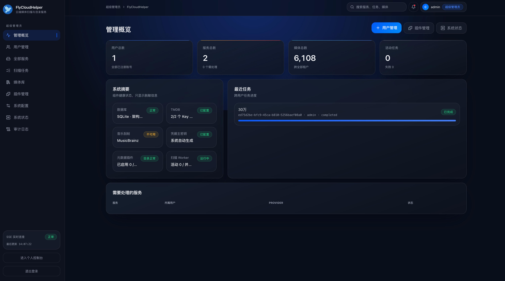

# FlyCloudHelper


FlyCloudHelper 是面向 Flymby 客户端的自部署云端媒体扫描、刮削和目录服务。它负责连接用户创建的网盘服务、扫描媒体文件、识别电影与节目、获取元数据并保存媒体目录；Web 管理端用于管理用户、服务、扫描任务、插件和系统配置，并通过海报墙浏览结果，不提供在线播放。

当前版本仅开放影视扫描与刮削。数据模型和处理器接口已预留音乐、有声书及更多网盘 Provider 的扩展能力。

## 界面预览

### 管理概览



### 媒体库


## 主要功能

- 用户注册、登录和多用户数据隔离。
- 一个用户可创建多个独立网盘服务和媒体库。
- 服务、任务和媒体目录全部直接使用用户 ID 归属。
- 支持 WebDAV、光鸭、阿里云盘、百度网盘 Provider 接口；光鸭支持官方 API、网页二维码和网页验证码三种登录连接。
- WebDAV 与光鸭支持服务级中转播放开关；开关默认关闭，不提供转码或 Web 前端播放。
- 配置全量扫描目录、增量扫描目录、本地 NFO、元数据规则和服务级任务并发。
- 扫描任务进度、当前路径、WebDAV 检查点暂停/继续、终止、删除和失败重试。
- TMDB 多 Key 自动切换；全部 Key 因限流或临时故障不可用时，任务保留检查点并到期自动恢复；成功元数据在当前部署内跨用户、跨服务共享缓存 14 天。
- 电影、节目匹配，支持手动匹配和清除匹配结果。
- 用户、服务及管理员范围的媒体海报墙和详情页。
- 超级管理员管理用户、全部服务、任务、插件、TMDB Key 和系统状态。
- 导出 Flymby APP 可导入的媒体库备份文件。

## 运行要求

- Node.js 20.19 或更高版本
- npm
- 默认无需安装外部数据库

## 本地启动

```sh
nvm use 20
npm install
npm run dev
```

启动后访问：

- Web 前端：`http://localhost:9935`
- 后台 API：`http://localhost:9934`
- 首次初始化：`http://localhost:9935/setup`

`npm run dev` 会同时启动前端和后台。也可以分别运行：

```sh
npm run dev:api
npm run dev:web
```

不创建 `.env` 时，服务默认使用 SQLite，数据库文件位于 `data/database/flycloud-helper.db`。首次运行会自动创建数据库结构；超级管理员账号需要在初始化页面中设置。

## Docker 启动

### 前后端集成版

生产镜像已经集成 Web 前端、后台 API 和扫描 Worker，部署时只需要启动一个容器。

#### 使用 Docker Compose（推荐）

Docker 部署也比较简单，新建 `docker-compose.yml` 并写入以下内容：

```yaml
services:
  flycloud-helper:
    image: fbinba3955/flycloud-helper:latest
    container_name: flycloud-helper
    restart: unless-stopped
    ports:
      - "9934:9934"
    environment:
      FLYCLOUDHELPER_DATABASE_TYPE: sqlite
      FLYCLOUDHELPER_COOKIE_SECURE: "false"
      FLYCLOUDHELPER_ALLOW_INSECURE_HTTP: "true"
      FLYCLOUDHELPER_PUID: "1000"
      FLYCLOUDHELPER_PGID: "1000"
    volumes:
      - flycloud_helper_data:/data

volumes:
  flycloud_helper_data:
```

然后启动服务：

```sh
docker compose up -d
```

也可以直接下载项目提供的完整配置文件：

```sh
# 下载配置文件
curl -o docker-compose.yml https://raw.githubusercontent.com/fbinba3955/FlyCloudHelper/master/docker-compose.yml

# 启动服务
docker compose up -d

# 查看日志
docker compose logs -f
```

该编排默认拉取 `fbinba3955/flycloud-helper:latest`，使用 SQLite，并把数据库、凭据主密钥、插件和导出文件保存在 `flycloud_helper_data` 持久卷中。启动完成后访问：

```text
http://服务器IP:9934/setup
```

首次进入初始化页面设置超级管理员。需要修改对外端口或连接外部数据库时，在 `docker-compose.yml` 同目录创建 `.env`；例如修改宿主机端口：

```dotenv
FLYCLOUDHELPER_HOST_PORT=19934
```

常用维护命令：

```sh
# 查看运行状态
docker compose ps

# 查看实时日志
docker compose logs -f flycloud-helper

# 拉取新版本并保留原数据升级
docker compose pull
docker compose up -d

# 停止服务但保留数据
docker compose down
```

不要使用 `docker compose down -v`，该命令会同时删除持久卷。需要固定镜像版本时，在 `.env` 中设置 `FLYCLOUDHELPER_IMAGE_TAG=0.1.5`；移除该配置后会继续使用 `latest`。

如果已经克隆项目，进入项目目录直接执行 `docker compose -f docker-compose.yml up -d` 即可。完整编排文件见 [docker-compose.yml](docker-compose.yml)。

#### 直接使用 Docker 命令

直接运行 Docker Hub 公开镜像：

```sh
docker run -d \
  --name flycloud-helper \
  --restart unless-stopped \
  -p 9934:9934 \
  -v flycloud_helper_data:/data \
  fbinba3955/flycloud-helper:latest
```

镜像同时支持 `linux/amd64` 和 `linux/arm64`。固定版本可将 `latest` 改为 `0.1.5`。

容器内部端口固定为 `9934`，`-p` 左侧可以修改宿主机端口。`/data` 必须持久化，其中保存 SQLite 数据库、凭据主密钥、插件和导出文件。即使改用 PostgreSQL 或 MySQL，也不能删除这个数据卷。

镜像启动时会先以 root 身份创建并修复 `/data` 下的数据库、密钥、插件、导出和迁移目录，再按 `FLYCLOUDHELPER_PUID`、`FLYCLOUDHELPER_PGID` 指定的普通用户身份启动服务，默认均为 `1000`。这可以兼容极空间、飞牛等 NAS 创建的 root 所有宿主机挂载目录。使用目录映射且 NAS 所有者不是 `1000:1000` 时，应把两个变量改成该目录实际的 UID/GID；只读挂载、NFS/SMB root squash 或 NAS ACL 禁止容器修改权限时，仍需先在宿主机授权。

启动后访问 `http://服务器地址:9934/setup` 设置超级管理员。

### 连接已有 PostgreSQL

创建不会提交到 Git 的 `.env`：

```dotenv
FLYCLOUDHELPER_DATABASE_TYPE=postgres
FLYCLOUDHELPER_DATABASE_HOST=postgres容器名
FLYCLOUDHELPER_DATABASE_PORT=5432
FLYCLOUDHELPER_DATABASE_NAME=flycloud_helper
FLYCLOUDHELPER_DATABASE_USER=flycloud_helper
FLYCLOUDHELPER_DATABASE_PASSWORD=请替换
FLYCLOUDHELPER_DATABASE_AUTO_CREATE=true
```

如果 PostgreSQL 与 FlyCloudHelper 都运行在 Docker 中，应让两个容器加入同一个网络，并把 `DATABASE_HOST` 设置为 PostgreSQL 容器名，不要填写 `127.0.0.1`：

```sh
docker network create flycloud-network
docker network connect flycloud-network 已有PostgreSQL容器名

docker run -d \
  --name flycloud-helper \
  --restart unless-stopped \
  --network flycloud-network \
  --env-file .env \
  -p 9934:9934 \
  -v flycloud_helper_data:/data \
  fbinba3955/flycloud-helper:latest
```

两个容器已经处于同一网络时，不需要重复执行 `docker network connect`。如果数据库运行在其他主机，`DATABASE_HOST` 填写数据库主机的 IP 或域名。

数据库不存在且自动创建开启时，PostgreSQL 用户必须拥有 `CREATEDB` 权限。服务只创建 `DATABASE_NAME` 指定的数据库，并自动初始化 FlyCloudHelper 表结构，不会创建数据库用户。数据库创建完成后可以按部署策略收回该用户的 `CREATEDB` 权限。

### 连接已有 MySQL

MySQL 使用相同的配置方式：

```dotenv
FLYCLOUDHELPER_DATABASE_TYPE=mysql
FLYCLOUDHELPER_DATABASE_HOST=mysql容器名
FLYCLOUDHELPER_DATABASE_PORT=3306
FLYCLOUDHELPER_DATABASE_NAME=flycloud_helper
FLYCLOUDHELPER_DATABASE_USER=flycloud_helper
FLYCLOUDHELPER_DATABASE_PASSWORD=请替换
FLYCLOUDHELPER_DATABASE_AUTO_CREATE=true
```

MySQL 容器同样需要与 FlyCloudHelper 处于同一个 Docker 网络。自动创建要求用户对目标数据库拥有 `CREATE` 及后续建表、索引和读写权限；服务不会创建数据库用户。

### 使用项目 Compose 创建数据库

由项目同时创建 PostgreSQL 时，在 `.env` 中设置：

```dotenv
POSTGRES_DB=flycloud_helper
POSTGRES_USER=flymby
POSTGRES_PASSWORD=请替换
```

然后执行：

```sh
docker compose -f compose.yml -f compose.postgres.yml up -d
```

由项目同时创建 MySQL 时，在 `.env` 中设置：

```dotenv
MYSQL_DATABASE=flycloud_helper
MYSQL_USER=flymby
MYSQL_PASSWORD=请替换
MYSQL_ROOT_PASSWORD=请替换
```

然后执行：

```sh
docker compose -f compose.yml -f compose.mysql.yml up -d
```

### 从源码构建

从源码构建并启动：

```sh
docker compose -f compose.yml -f compose.build.yml up -d --build
```

默认通过 `http://localhost:9934` 访问服务。生产镜像由同一个 API 进程提供后台接口、Web 静态文件和扫描 Worker。

生产镜像已经直接安装 `ffprobe`（由 Debian `ffmpeg` 软件包提供），同时支持 `linux/amd64` 和 `linux/arm64`。服务详情中的“分析视频规格（ffprobe）”默认关闭；开启后无需在宿主机安装程序或向容器挂载可执行文件。

## 配置方式

复制示例文件后按需修改：

```sh
cp .env.example .env
```

常用环境变量如下。镜像已经在 `ENV` 元数据中声明数据库拆分字段、自动建库、Cookie 和 HTTP Provider 开关，因此 Docker 管理界面可以直接显示这些配置项；数据库地址、端口、名称、用户名和密码默认留空。

| 变量 | 默认值 | 说明 |
| --- | --- | --- |
| `FLYCLOUDHELPER_HOST_PORT` | `9934` | Docker 对外端口 |
| `FLYCLOUDHELPER_PUID` | `1000` | 容器内后台进程使用的用户 ID；启动时用于修复 `/data` 权限 |
| `FLYCLOUDHELPER_PGID` | `1000` | 容器内后台进程使用的用户组 ID；启动时用于修复 `/data` 权限 |
| `FLYCLOUDHELPER_DATABASE_TYPE` | `sqlite` | 数据库类型：`sqlite`、`postgres` 或 `mysql` |
| `FLYCLOUDHELPER_SQLITE_PATH` | `data/database/flycloud-helper.db` | SQLite 文件位置 |
| `FLYCLOUDHELPER_DATABASE_HOST` | 空 | PostgreSQL 或 MySQL 地址 |
| `FLYCLOUDHELPER_DATABASE_PORT` | `5432`/`3306` | PostgreSQL 或 MySQL 端口 |
| `FLYCLOUDHELPER_DATABASE_NAME` | 空 | FlyCloudHelper 使用的数据库名称 |
| `FLYCLOUDHELPER_DATABASE_USER` | 空 | 数据库用户名 |
| `FLYCLOUDHELPER_DATABASE_PASSWORD` | 空 | 数据库密码，支持使用同名 `_FILE` 变量读取 Secret |
| `FLYCLOUDHELPER_DATABASE_AUTO_CREATE` | `true` | 数据库不存在时尝试自动创建 |
| `FLYCLOUDHELPER_DATABASE_URL` | 空 | 兼容原有完整连接地址，配置后优先于拆分字段 |
| `FLYCLOUDHELPER_COOKIE_SECURE` | `false` | HTTPS 部署时设为 `true` |
| `FLYCLOUDHELPER_WORKER_CONCURRENCY` | `5` | 同时执行的扫描刮削任务数 |
| `FLYCLOUDHELPER_FFPROBE_PATH` | Docker 中为 `/usr/bin/ffprobe` | ffprobe 可执行文件路径 |
| `FLYCLOUDHELPER_MEDIA_PROBE_CONCURRENCY` | `1` | 独立媒体规格队列并发数；不会占用扫描 Worker 槽位 |
| `FLYCLOUDHELPER_ALLOW_INSECURE_HTTP` | `true` | 是否允许 Provider 使用 HTTP |
| `FLYCLOUDHELPER_HUAWEI_BINDING_PROOF_SECRET` | 空 | 可选的华为账号绑定凭证验签密钥；配置后 APP 注册必须提供短期受信任签名，支持同名 `_FILE` Secret |

完整配置见 [.env.example](.env.example)。旧版 `FLYMBYSCANNER_*` 环境变量仍可由后台兼容读取，建议新部署统一改为 `FLYCLOUDHELPER_*`。

TMDB Key 不再通过环境变量配置。超级管理员登录后，在“系统配置”页面中维护一个或多个 Key；后台会根据健康 Key 数量动态调整刮削并发。

内置 TMDB 刮削使用数据库持久化共享缓存，无需额外配置。电影、节目详情和节目季数据按媒体身份、标题查询条件、语言、地区与详情模式区分，成功结果保留 14 天；缓存不绑定用户、服务或网盘类型，因此同一部署中的 WebDAV、光鸭以及后续接入的网盘可以复用。未匹配、鉴权失败、限流和网络错误不会进入共享缓存，音乐、有声书及插件自有元数据源不使用这份缓存。超级管理员可以在“系统配置”中二次确认后删除全部 TMDB 共享缓存，已入库的媒体数据不会随之删除。

APP 注册始终要求华为账号身份摘要。默认空配置适合当前开发联调，只能防止同一摘要重复注册；正式开放注册时建议配置 `FLYCLOUDHELPER_HUAWEI_BINDING_PROOF_SECRET`，并由受信任的账号服务按 `v1.过期秒时间戳.随机串.HMAC-SHA256(base64url)` 签发短期凭证。签名正文固定为 `v1\n账号摘要\n过期秒时间戳\n随机串`；配置验签密钥后，缺少、过期或签名无效的注册请求会被拒绝。

PostgreSQL 与 MySQL 使用拆分字段时，服务会自动处理密码中的特殊字符。目标数据库不存在且自动创建开启时，PostgreSQL 用户需要 `CREATEDB` 权限，MySQL 用户需要 `CREATE` 权限；服务只创建指定数据库，之后自动初始化自身表结构，不会创建数据库用户。

网盘服务默认使用 Flymby APP 的任务参数：扫描任务数为 8、刮削任务数为 4。扫描任务数可在 1–16 之间调整，刮削任务数可在 1–4 之间调整；全量扫描的实际目录并发固定不超过 1，增量扫描使用服务设置。影片任务使用服务配置的刮削并发，TMDB 网络请求则由当前可用 Key 容量独立限流，不会因为 Key 数量减少而把本地解析和数据库落库一起降为低并发。同一节目目录中的单集文件并发落库；重复全量扫描仍会枚举全部路径并执行缺失对账，但会复用源文件未变化、已匹配且元数据配置修订一致的目录结果。

影视文件名使用 Flymby APP 同源清洗顺序生成刮削查询词，依次移除站点和分类前缀、TMDB/IMDb 标记、合集范围、清晰度和尺寸、来源、编码与位深、音轨字幕、平台、文件大小及发布组；清洗只影响识别查询，不修改网盘中的真实路径和文件名。

## 光鸭登录、扫描与文件访问

光鸭连接固定分为三类：

- `光鸭官方 API 登录`：只能先在 Flymby APP 中完成登录，再通过已认证的 Fly云助手接口同步连接。Fly云助手前台不提供该登录入口。
- `光鸭网页二维码登录`：只能在 Fly云助手前台发起，使用光鸭 APP 扫码确认。
- `光鸭网页验证码登录`：只能在 Fly云助手前台发起，使用中国大陆手机号和短信验证码登录；未注册手机号按光鸭官网规则创建账号。

网页二维码和网页验证码都通过一次性授权会话创建服务，Token、设备码、手机号原文和短信验证码不会由状态接口回显或写入诊断日志。连接成功后，Access Token、Refresh Token 等字段使用凭据主密钥加密保存。

Flymby APP 同步官方 API 连接时，可复用服务创建和连接更新接口。更新已有光鸭服务的示例：

```http
PUT /api/v1/services/{serviceId}/connection
Authorization: Bearer {Fly云助手登录令牌}
Content-Type: application/json
```

```json
{
  "connection": {
    "authMode": "official_api",
    "clientId": "由 APP 当前光鸭配置提供",
    "projectId": "由 APP 当前光鸭配置提供",
    "signSecret": "由 APP 当前光鸭配置提供",
    "deviceId": "由 APP 当前授权提供",
    "accessToken": "由 APP 当前授权提供",
    "refreshToken": "由 APP 当前授权提供",
    "tokenType": "Bearer",
    "expiresAt": 0,
    "userId": "可选的光鸭账号 ID"
  }
}
```

服务端只接受固定字段，并在验证根目录访问成功后替换连接。生产环境建议通过 HTTPS 传输；启用项目的非安全 HTTP 配置时，局域网或调试环境也可以使用 HTTP。创建新服务时使用 `POST /api/v1/services`，把同一 `connection` 放到 `provider.connection`，并设置 `provider.type` 为 `guangya`；创建成功不会自动触发扫描。

授权完成后可在服务详情中逐级选择光鸭目录，再创建全量或增量扫描任务。光鸭文件枚举结果进入与 WebDAV 相同的影视处理管线，继续执行视频过滤、电影/节目识别、TMDB 刮削、媒体目录落库和增量变更记录。

APP 可使用以下接口访问结果：

- `GET /api/v1/libraries/:libraryId/items/:itemId/files`：读取影片绑定的源文件及稳定定位。
- `POST /api/v1/libraries/:libraryId/items/:itemId/files/:fileId/access`：用 APP Bearer Token 换取短期文件下载地址；响应不会包含光鸭账号 Token。

APP 首次把本地 WebDAV 或光鸭视频库创建为云端服务时，可以上传一次本地目录快照。绑定完成后以 FlyCloudHelper 为唯一主数据：后续扫描、匹配和清除匹配都由云端执行；只有用户在 APP 服务设置中选择一份已完成快照并手动同步时，才下载完整目录快照并在本地事务中全量替换，网络异常时保留上一份完整快照，不会把本地旧数据反向覆盖到云端。云端目录快照使用 v3 ZIP 分片格式，关系、影片和源文件每 200 条写一个 JSON 分片后压缩，APP 下载后先解压、轻量预读，再逐分片导入，避免在内存中构造完整媒体数组；当前不兼容 v1/v2 开发期快照。APP 使用 `flycloud:<目录版本>:<快照ID>` 标记当前本地快照，同一服务只保留最后一次成功导入的副本；用户删除对应的云端快照记录不会删除已经同步到本机的副本。服务端同时保证一个源文件只归属一个媒体条目。

网页服务详情把服务状态作为顶部全局属性展示，连接替换与快照管理分别使用独立页面。用户和超级管理员都可以从快照管理页创建后台快照任务、每 5 秒查看生成进度，并在二次确认后删除已结束的快照；同一媒体库已有生成中任务时不能重复创建。

右上角通知中心会持久化展示扫描和快照任务结果，以及新账号注册、服务删除、媒体库清空、密码重置、角色或状态修改、会话撤销等敏感操作。通知严格按用户归属读取，每 10 秒刷新一次，支持单条清除和全部清除；通知清除不会删除审计日志。
- `GET/HEAD /api/v1/libraries/:libraryId/items/:itemId/files/:fileId/stream`：当对应服务已开启中转播放时，通过 FlyCloudHelper 流式读取源文件，支持 HTTP Range。

文件访问接口返回 `accessType=temporary_url`、`url`、`headers` 和 `expiresAt`，APP 可在地址过期前直接访问网盘/CDN。若用户在服务详情的“播放设置”中开启“中转播放”，APP 也可以携带 FlyCloudHelper Bearer Token 请求中转接口；服务端只按字节流转发源文件，不转码、不缓存媒体正文，也不会向 APP 返回 WebDAV 密码、Token 或上游认证头。关闭开关时中转接口返回 `409 relay_playback_disabled`。

中转播放开关通过以下接口立即保存，且只影响指定服务：

```http
PATCH /api/v1/services/{serviceId}/playback-settings
Authorization: Bearer {Fly云助手登录令牌}
Content-Type: application/json

{"relayPlaybackEnabled": true}
```

超级管理员管理其他用户服务时使用 `/api/v1/admin/services/{serviceId}/playback-settings`。中转播放会同时占用 FlyCloudHelper 的下载和上传带宽；关闭开关不会影响扫描、刮削和 APP 获取直连临时地址。光鸭网页接口或开放平台接口发生变更时，Provider 适配器也需要同步升级。

## 未来计划

后续功能按以下顺序推进。每个阶段先稳定服务端数据结构、接口和后台任务，再接入 Flymby 客户端，避免不同媒体类型和客户端各自维护一套不兼容的数据。

1. **接入百度网盘和阿里云盘**

   补充两类网盘的账号授权、Token 刷新、重新授权、目录选择、文件枚举、全量与增量扫描、直连下载和中转播放能力；扫描结果继续进入现有影视识别、TMDB 刮削、任务进度和媒体目录体系，并保持 Provider 接口可扩展。

2. **把云助手中的服务同步到 Flymby APP**

   APP 登录 Fly云助手后可以发现账号下已经存在的服务，选择后在本机恢复服务入口、媒体库绑定和必要的非敏感配置，不再要求每台设备都从本地服务重新创建。云端继续作为主数据，本机只保存登录状态、绑定关系和用户手动同步的快照。

3. **同步播放进度**

   以云助手用户、服务、媒体条目和源文件的稳定标识保存播放位置、已播放状态和最近播放时间，实现多设备续播。需要同时处理离线提交、重复上报、进度冲突和媒体重新匹配后的身份迁移，且不上传媒体正文。

4. **支持 Flymby TV 同步**

   Flymby TV 登录同一云助手账号后，可以同步可用服务、媒体目录、收藏和播放进度，在电视端继续浏览与播放；手机端和电视端共用云端媒体身份，避免分别扫描或生成互不兼容的本地目录。

5. **支持 Jellyfin 协议**

   为兼容客户端提供 Jellyfin 风格的登录、媒体库、首页、列表、搜索、详情、季集和播放定位接口，并建立 FlyCloudHelper 用户、服务、媒体条目与 Jellyfin 协议对象之间的稳定映射。第一阶段以浏览和播放兼容为主，转码等能力单独规划。

6. **支持音乐扫描、刮削与同步**

   增加音频文件枚举、标签读取、艺术家/专辑/曲目归组、封面与歌词管理，以及 MusicBrainz 等音乐元数据来源；同步扩展媒体库接口、快照格式和 APP 展示模型，使音乐目录可以在多端保持一致。

7. **支持有声书扫描、刮削与同步**

   增加作品、作者、演播者、分卷、章节和音频文件的识别与归组，支持封面、简介和章节级播放进度；在音乐能力稳定后复用音频扫描基础设施，同时保持有声书独立的目录结构和续播语义。

## 数据与密钥

本地开发数据保存在 `data/`，Docker 数据保存在 `flycloud_helper_data` 持久卷。未配置凭据主密钥时，服务首次启动会随机生成并保存到 `data/secrets/credential-master-key`；设置超级管理员时需要按页面提示备份该密钥。密钥丢失后，数据库中已有的网盘凭据将无法解密。

切换 SQLite、PostgreSQL 或 MySQL 不会自动迁移数据，需要自行执行导出、导入或数据库迁移。

当前项目处于 `0.x` 开发阶段，schema 28 已加入用户直接归属的数据结构、服务级中转播放、Jellyfin 兼容和源文件媒体规格队列。升级现有数据库时服务会自动创建新增表；使用不兼容的旧开发数据库时也可以删除并重新初始化，首次启动后重新设置超级管理员。

## 项目结构

```text
api/       Fastify API、数据库、Provider、扫描 Worker 与刮削逻辑
web/       React 管理前端
data/      本地数据库、密钥、插件和导出文件（不会提交到 Git）
```
