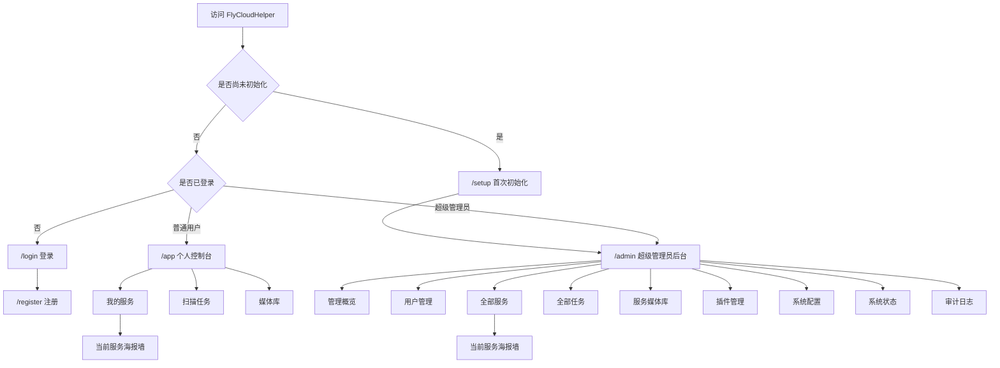

# FlyCloudHelper 前端页面功能文档

> 用途：供产品原型、UI/UX 设计稿和前端页面拆分使用。  
> 当前阶段：页面设计稿和首期后台接口已实现；认证页面已接真实 API，其他业务页仍待逐页联调。  
> 依据：`Spec规格文档.md`、`开发计划文档.md`、`需求与接口对照文档.md`。  
> 本文只定义 Web 前端。Flymby APP 和 Android TV 的云端模式页面不在本次设计稿范围内。

## 1. 产品定位

FlyCloudHelper 是一个通过 Docker 部署的云端媒体扫描与目录服务。用户可以在 Web 前端创建网盘服务，配置扫描路径、媒体类型和刮削规则，触发视频、音乐、有声书的扫描刮削，并通过实时任务进度和海报墙查看结果。

当前实施阶段的服务数据类型只开放“影视”；创建页仍展示“音乐”和“有声书”两个扩展选项，但必须禁用并标注“暂未支持”。后续开放时复用同一 `dataType` 字段和页面位置。

Web 前端承担“配置、管理、进度查看和目录浏览”，不承担媒体播放：

- 不展示播放按钮、播放器、试听、预览和下载入口。
- 不向浏览器返回网盘密码、Token、Cookie、完整请求头、临时播放地址或 `playbackLocator`。
- 点击媒体卡片只进入只读详情；双击、长按、右键和键盘确认均不得触发播放。
- 视频、音乐和有声书使用统一目录框架，但允许各媒体类型使用不同卡片比例、字段和筛选项。
- 一个部署实例支持多个用户；每个用户可以拥有多个网盘服务和媒体库，所有页面必须明确当前数据归属。

## 2. 设计目标与非目标

### 2.1 设计目标

1. 用户从注册、登录、创建服务到首次扫描形成完整闭环。
2. 用户能快速判断服务连接状态、当前任务进度和最近扫描结果。
3. 超级管理员能跨用户管理账号、服务、任务、目录、插件和系统状态。
4. 多用户、多服务、多媒体类型场景下，页面始终显示明确的筛选上下文。
5. Secret、权限和危险操作在界面上有清晰但不过度暴露的反馈。
6. 页面结构为后续新增网盘 Provider、元数据来源和媒体类型保留扩展位置。

### 2.2 本次不设计

- Web 播放、试听、媒体文件下载和媒体代理。
- 在线编辑 Docker 环境变量或数据库连接信息；TMDB Key 仅允许超级管理员在系统配置页整组替换，已有原文不回显。
- 上传或执行网盘 Provider、脚本、二进制及其他任意代码插件。
- APP 和 Android TV 的云端服务添加流程。
- 版权相关页面和合规文案，本阶段暂不展开。

## 3. 用户角色与权限

系统首期只有 `user` 和 `super_admin` 两种角色。超级管理员同样拥有个人租户，可以管理自己的服务和目录。

| 功能 | 普通用户 `user` | 超级管理员 `super_admin` |
| --- | --- | --- |
| 注册、登录、退出 | 支持 | 支持登录、退出；首个账号由初始化创建 |
| 查看个人概览 | 仅本人 | 支持 |
| 创建和管理云端服务 | 仅本人 | 可管理任意用户的服务 |
| 触发扫描、重试任务 | 仅本人服务 | 任意用户服务 |
| 查看任务进度 | 仅本人任务 | 全部任务，可按用户筛选 |
| 浏览海报墙和媒体详情 | 仅本人目录 | 全部目录，可按用户筛选 |
| 用户和角色管理 | 不支持 | 支持 |
| 插件导入、配置和启停 | 不支持 | 支持 |
| 系统状态、配置状态、审计 | 不支持 | 支持 |

权限设计要求：

- 普通用户不得看见管理菜单；直接访问 `/admin` 时展示无权限页或跳回 `/app`。
- 前端隐藏按钮不是权限控制，服务端仍需对全部 `/api/v1/admin/*` 接口校验 `super_admin`。
- 角色变更、停用、删除等危险操作必须二次确认；角色变更还需要最近重新认证。
- 页面主标题下方不展示说明性副标题；必要说明放入对应内容卡片、字段提示或操作确认中。
- 不允许降级、停用或删除最后一个有效超级管理员。

## 4. 页面信息架构

### 4.1 路由和页面清单

| 页面编号 | 页面 | 建议路由 | 角色 | 首期优先级 |
| --- | --- | --- | --- | --- |
| AUTH-01 | 首次初始化 | `/setup` | 未初始化部署者 | P0 |
| AUTH-02 | 登录 | `/login` | 访客 | P0 |
| AUTH-03 | 注册 | `/register` | 访客 | P0 |
| U-01 | 个人概览 | `/app` | `user`、`super_admin` | P0 |
| U-02 | 我的服务 | `/app/services` | 已登录用户 | P0 |
| U-03 | 创建服务 | `/app/services/new` | 已登录用户 | P0 |
| U-04 | 服务详情与配置 | `/app/services/:serviceId` | 服务所有者 | P0 |
| U-04A | 服务海报墙 | `/app/services/:serviceId/catalog` | 服务所有者 | P0 |
| U-05 | 我的扫描任务 | `/app/jobs` | 已登录用户 | P0 |
| U-06 | 任务详情 | `/app/jobs/:jobId` | 任务所有者 | P0 |
| U-07 | 我的媒体库 | `/app/catalog` | 已登录用户 | P0 |
| U-08 | 媒体详情 | `/app/catalog/:itemId` | 有目录权限的用户 | P0 |
| A-01 | 管理概览 | `/admin` | `super_admin` | P0 |
| A-02 | 用户管理 | `/admin/users` | `super_admin` | P0 |
| A-03 | 用户详情 | `/admin/users/:userId` | `super_admin` | P0 |
| A-04 | 全部服务 | `/admin/services` | `super_admin` | P0 |
| A-05 | 管理服务详情 | `/admin/services/:serviceId` | `super_admin` | P0 |
| A-05A | 管理服务海报墙 | `/admin/services/:serviceId/catalog` | `super_admin` | P0 |
| A-06 | 全部扫描任务 | `/admin/jobs` | `super_admin` | P0 |
| A-07 | 管理任务详情 | `/admin/jobs/:jobId` | `super_admin` | P0 |
| A-08 | 服务媒体库选择 | `/admin/catalog` | `super_admin` | P0 |
| A-09 | 管理媒体详情 | `/admin/catalog/:itemId` | `super_admin` | P0 |
| A-10 | 插件管理 | `/admin/plugins` | `super_admin` | P0 |
| A-11 | 插件详情与配置 | `/admin/plugins/:pluginId` | `super_admin` | P0 |
| A-12 | 系统配置 | `/admin/config` | `super_admin` | P0 |
| A-13 | 系统状态 | `/admin/system` | `super_admin` | P0 |
| A-14 | 审计日志 | `/admin/audit` | `super_admin` | P1 |
| S-01 | 无权限 | `/403` 或页面内状态 | 全部 | P0 |
| S-02 | 页面不存在 | `/404` | 全部 | P0 |

说明：服务创建、插件导入、创建用户可以采用独立页面、全屏抽屉或大尺寸对话框。本文按完整业务页面描述，设计阶段可根据屏幕尺寸决定具体容器。

## 5. 全局框架和公共交互

### 5.1 未登录页面框架

- 居中显示产品标识、页面标题、简短说明和表单。
- 登录页与注册页必须提供彼此跳转入口。
- 首次初始化页应和普通注册页有明显区分，明确“正在创建本实例的首个超级管理员”。
- 表单错误优先显示在对应字段下；全局错误显示在表单顶部，不暴露内部异常和账号是否存在。

### 5.2 登录后控制台框架

建议使用“左侧导航 + 顶部栏 + 主内容区”的控制台结构：

- 左侧导航：展示当前角色允许访问的一级模块。
- 顶部栏：页面标题、当前用户、角色标识、退出入口；后台页可增加当前系统健康状态入口。
- 主内容区：页面说明、主操作、筛选区、内容区。
- 面包屑：详情页显示“模块 / 对象名称”，避免只显示不可读 ID。
- 用户切换到管理后台后，不得丢失其个人控制台入口；建议在头像菜单中提供“个人控制台/管理后台”切换。

普通用户导航：

1. 概览
2. 我的服务
3. 扫描任务
4. 媒体库

超级管理员导航：

1. 管理概览
2. 用户管理
3. 全部服务
4. 扫描任务
5. 媒体库
6. 插件管理
7. 系统状态
8. 审计日志

### 5.3 页面级上下文

- 普通用户页面固定使用当前用户租户，不显示用户筛选器。
- 管理员跨租户页面必须先显示目标用户，再显示服务、媒体库、媒体类型等下级筛选。
- 详情页至少显示对象名称和短 ID；复制完整 ID 应使用单独复制按钮。
- 所有服务卡片、任务行和媒体条目都应能辨认所属服务；管理员页面还必须显示所属用户。

### 5.4 实时数据反馈

- 任务进度通过 SSE 实时更新，页面需显示“实时连接正常、正在重连、连接中断”三种状态。
- SSE 重连期间保留最后一次数据，不把任务误显示为失败。
- 媒体目录收到 `catalogVersion` 更新后刷新受影响列表；已经入库的阶段性结果可以在任务完成前出现。
- 列表刷新时尽量保留筛选条件、排序、分页位置和当前展开对象。

## 6. 认证和初始化页面

### 6.1 AUTH-01 首次初始化

**页面目标**：空数据库实例第一次启动时，创建唯一的首个超级管理员。

**进入条件**：`GET /api/v1/setup/status` 返回 `setupRequired=true`，或者初始化完成但 `credentialKeyBackupRequired=true` 且当前会话为刚创建的超级管理员。未完成初始化前，其他业务页面统一重定向到 `/setup`。

**表单字段**：

| 字段 | 必填 | 规则 | 设计提示 |
| --- | --- | --- | --- |
| 超级管理员用户名 | 是 | 至少 4 个 Unicode 字符；首尾空白无效 | 标明这是首个管理员账号 |
| 密码 | 是 | 至少 4 个 Unicode 字符 | 密码可见性切换，不显示默认密码 |
| 确认密码 | 是 | 必须和密码一致 | 实时提示不一致 |

**页面操作**：

- 主操作：“完成初始化”。
- 提交中锁定重复提交。
- 成功后建立登录会话；若服务自动生成凭据主密钥，先进入密钥备份步骤，完成确认后再进入 `/admin`。
- 如果其他请求已抢先初始化，提示“初始化已完成”，然后跳转登录页。

**主密钥备份步骤**：

- 展示自动生成的 `FLYCLOUDHELPER_CREDENTIAL_MASTER_KEY` 原文，并明确说明它用于恢复网盘凭据。
- 提供“复制密钥”和“下载备份”操作；下载文件只包含密钥正文，可直接作为 Docker Secret 文件使用。
- 管理员必须勾选“已保存到数据库和 Docker 数据卷之外”，才能点击“已完成备份，进入后台”。
- 确认后服务端清除待备份状态，后续接口和页面不再返回密钥原文。
- 初始化响应丢失或页面刷新时，已登录超级管理员可以在确认前重新读取；未登录访问者不能取得密钥。

**重要边界**：

- 不出现一次性初始化凭证字段。
- 不出现环境变量账号密码配置说明。
- 页面需提示部署者应在受控网络完成初始化后再开放公网，但不把运维流程设计成额外表单。
- 管理员确认主密钥备份后初始化入口永久关闭；再次访问直接跳转登录或后台。

### 6.2 AUTH-02 登录

**页面目标**：所有已创建账号统一登录。

**字段**：用户名、密码。

**操作与状态**：

- 主操作：“登录”。
- 次操作：“还没有账号？注册”。
- 用户名或密码不足 4 个字符时本地提示。
- 登录失败统一提示“用户名或密码错误”，不区分账号不存在和密码错误。
- 普通用户登录后进入 `/app`；超级管理员进入 `/admin`；如存在合法的原授权目标则返回该页面。
- 令牌失效时显示会话过期提示，保留当前页面地址并引导重新登录。

### 6.3 AUTH-03 注册

**页面目标**：公开创建普通用户账号。

**字段**：用户名、密码、确认密码。

**操作与状态**：

- 主操作：“创建账号”。
- 次操作：“已有账号？返回登录”。
- 用户名和密码都至少 4 个 Unicode 字符，确认密码必须一致。
- 不提供角色字段，公开注册固定创建 `user`。
- 用户名冲突时明确提示用户名已被使用。
- 注册成功后自动登录并进入 `/app`。
- 注册是否默认开放、需要注册码或管理员审核仍待确认；设计稿应把注册入口做成可配置显示，不增加未确认的审核页面。

## 7. 个人控制台页面

### 7.1 U-01 个人概览

**页面目标**：让用户快速看到本人服务、任务和目录的整体状态。

**信息模块**：

- 数据摘要：服务总数、可用服务数、媒体总数、视频数、音乐数、有声书数。
- 当前任务：运行中、排队中、失败任务数量。
- 最近任务：服务名称、模式、阶段、进度、开始时间、状态。
- 最近入库：三类媒体混合展示，点击进入只读详情。
- 异常提醒：需要重新授权的服务、连接失败、最近失败任务。

**主要操作**：

- “创建云端服务”。
- “查看全部任务”。
- “浏览媒体库”。
- 异常提醒直接进入对应服务或任务详情。

**空状态**：没有服务时以创建服务为唯一主引导，不展示无意义的零数据图表。

### 7.2 U-02 我的服务

**页面目标**：管理当前用户拥有的全部网盘服务。

**顶部区域**：页面说明、“创建服务”主按钮、搜索、Provider 类型筛选、服务状态筛选。

**列表/卡片字段**：

- 服务名称。
- Provider 类型和图标。
- 状态：正常、需要重新授权、已停用、待删除。
- 数据类型：影视；音乐和有声书为后续扩展类型。
- 扫描路径数量。
- 媒体数量和最后目录更新时间。
- 最近扫描任务状态和时间。
- 连接配置修订、扫描配置修订、元数据配置修订可放在详情页，不必占用主列表。

**行级操作**：查看详情、触发扫描、更新连接、启用/停用、删除。

**设计要求**：

- “需要重新授权”必须是强提示，并把“更新连接”作为推荐操作。
- 触发扫描前可选择全量或增量模式；默认值来自服务配置。
- 删除属于异步受保护操作，确认框需说明影响对象数量；提交后显示删除任务状态，而不是立即从列表消失。

### 7.3 U-03 创建服务

创建页只负责基本信息、Provider 连接信息和连接验证。服务创建成功后直接进入服务详情，但不能自动创建扫描任务，也不能自动开始刮削；全量路径、增量路径和刮削配置均在服务详情中单独保存。

#### 第一步：基本信息

- 服务名称 `displayName`。
- 数据类型 `dataType`：选项为影视、音乐、有声书；当前只有影视可选，音乐和有声书禁用并显示“暂未支持”。
- Provider 类型：首批为 WebDAV、光鸭、阿里云盘、百度网盘；列表需要支持后续扩展。
- 普通用户不显示所属用户字段；管理员代建时必须先选择目标用户。

#### 第二步：连接信息

- 根据 Provider 的连接 Schema 动态生成字段。
- Secret 字段使用密码输入样式，仅用于写入，提交成功后不能回显原值。
- 提供“验证连接”按钮和四种反馈：未验证、验证中、验证成功、验证失败。
- 验证失败显示可操作的脱敏原因，不打印 Token、Cookie、完整请求头和连接密码。
- 切换 Provider 时提示会清空当前未保存连接字段。

#### 创建后：扫描范围

- 分别维护“全量扫描路径”和“增量扫描路径”，两个模式不能共用一组隐式默认根目录。
- 路径不提供文本输入框；点击“选择目录”后从 Provider 根目录逐级浏览，可选择当前目录或直接子目录，并可返回上一级。
- 目录选择 Dialog 挂载到页面根节点并覆盖控制台导航、页头和内容卡片，打开时锁定页面滚动，支持按 `Esc` 关闭。
- 服务数据类型是创建时确定的单选值，扫描范围必须与其一致；当前固定为影视，不允许通过请求提交音乐或有声书。
- 每种模式的扫描根列表包含资源标识/路径、展示路径、盘标识，以及该根允许识别的媒体类型。
- 支持选择和移除多个扫描根；弹窗在操作按钮区和目录列表之间展示临时已选目录，每条目录可通过叉号移除，重复目录显示为“已选择”且不能重复加入。
- 弹窗内的选择与移除只修改临时选择集；点击“确定”立即验证并保存对应的全量或增量扫描目录，保存成功后才关闭弹窗并同步到服务详情页，保存失败时保留弹窗和本次选择；点击取消、关闭或按 `Esc` 不保存本次修改。
- Provider 返回的当前路径只用于顶部路径提示和“选择当前目录”操作，不能重复出现在下面的子目录列表中。
- 已从配置中移除的扫描根处理策略使用当前方案值，页面提供简短影响说明。
- 空路径、重复路径、媒体类型为空时需明确字段错误；未配置对应模式路径时禁用扫描按钮，接口也拒绝创建任务。

#### 创建后：刮削配置

按服务数据类型展示独立配置卡片；当前只显示影视配置，音乐和有声书配置不进入表单。

视频配置：

- 使用中文表单展示，不向用户暴露或要求编辑元数据 Profile JSON。
- 首选元数据来源：TMDB 在线刮削、仅使用本地 NFO 和文件名；已配置的插件来源需要保留并显示。
- 元数据语言和内容地区使用中文下拉选项。
- 本地 NFO 提供“使用/不使用”开关；默认使用，开启时优先读取同目录 NFO，关闭时忽略 NFO 并直接使用所选元数据来源。
- 保存时保留表单暂未开放的扩展字段，避免覆盖已有插件或后续配置。

音乐配置：

- 来源：自动、MusicBrainz、网易云音乐、QQ 音乐、酷狗音乐、咪咕音乐、酷我音乐。
- 自动聚合模式：快速、完整；只在来源为“自动”时显示。
- 必需字段：艺术家、专辑、封面，可多选。
- 声纹策略：禁用、失败后备用、仅手动。
- 重新刮削范围：仅变化项、仅失败项、全部。

有声书配置：

- 是否优先读取文件内嵌标签。
- 元数据来源选择；具体内置来源尚未冻结，设计时使用可扩展下拉框。
- 重新刮削范围：仅变化项、仅失败项、全部。

如果某元数据来源来自插件，选项中应显示插件名称和版本状态；已停用但被历史任务引用的版本只用于历史展示，不允许作为新任务来源。

#### 确认创建

- 汇总服务名称、Provider 和连接验证状态。
- Secret 只显示“已填写”，不显示原值或局部值。
- 主操作：“验证连接并创建服务”。
- 创建成功后进入服务详情，先配置全量/增量路径，再由用户显式触发扫描。

### 7.4 U-04 服务详情与配置

**页面头部**：服务名称、Provider、状态、所属用户（仅后台显示）、服务短 ID、主要操作。

建议页签：

1. **概览**：媒体统计、最近扫描、连接状态、目录版本、最近异常。
2. **连接配置**：非敏感字段、Secret 配置状态、验证连接、更新连接。
3. **扫描范围**：通过网盘目录选择器分别设置全量扫描路径、增量扫描路径、媒体类型及移除策略，不允许手动输入路径；同时可设置扫描任务数和刮削任务数。
4. **刮削配置**：视频、音乐、有声书独立配置。
5. **海报墙**：仅显示当前服务已经入库的视频、音乐和有声书，可直接进入完整服务海报墙。
6. **扫描任务**：仅显示当前服务相关任务。
7. **客户端绑定**：展示已绑定客户端数量和标识摘要，不显示客户端本地网盘凭据。

**主要操作**：

- 触发扫描：选择全量/增量后提交。
- 更新连接：保存后生成新的连接修订。
- 使用当前配置重连：仅在连接状态为“需重新授权”时显示；直接验证服务端当前保存的凭据和扫描路径，成功后恢复连接状态，不要求重新填写 Secret。
- 保存扫描配置：生成新的扫描配置修订。
- 保存任务并发：新服务默认采用 Flymby APP 推荐值，扫描任务数为 8（1–16），刮削任务数为 4（1–4）；全量扫描实际目录并发固定为 1，增量扫描使用所选扫描任务数。
- 保存刮削配置：生成新的元数据配置修订。
- 查看服务海报墙：进入固定当前服务作用域的完整海报墙。
- 清空扫描刮削结果：二次确认后只清空当前服务的媒体条目、文件索引和目录版本，保留连接、路径、刮削配置和任务历史；存在活动任务时不可执行。
- 启用、停用、删除服务。

### 7.5 U-04A 服务海报墙

**页面目标**：从某个云端服务直接查看该服务扫描刮削出的全部内容，不需要再到“我的媒体库”重新选择服务。

**固定上下文**：

- 页面固定当前 `serviceId`，头部显示服务名称、Provider、服务状态和最近目录更新时间。
- 普通用户只能打开本人服务，不显示用户筛选器，也不能在页面中切换到其他用户。
- 服务只有一个媒体库时不显示媒体库选择器；后续一个服务存在多个媒体库时，再提供当前服务内的媒体库选择。
- 提供“返回服务详情”和“选择其他服务”入口。

**内容结构**：

- 服务媒体摘要：总条目数、视频数、音乐数、有声书数、待确认数、最近新增数。
- 媒体类型页签：全部、视频、音乐、有声书。
- 搜索、类型相关分面、匹配状态、排序和游标分页；匹配状态默认选择“已匹配”。
- 海报卡片、缺图状态和只读详情复用 U-07、U-08 规范。

**交互要求**：

- 路由中的 `serviceId` 是强制作用域；查询条件不能把页面切换到其他服务。
- 点击媒体卡片时建议进入 `/app/services/:serviceId/catalog/:itemId`，或复用 U-08 详情并携带安全返回上下文；返回后必须保留当前页签、筛选、排序和列表位置。
- 扫描任务阶段性提交内容后，当前服务海报墙通过 `catalogVersion` 更新。
- 服务处于“需要重新授权”或“已停用”时仍可浏览已入库内容，同时在页头显示状态提示。
- 页面仍然不提供播放、试听、预览、下载和媒体地址复制。

### 7.6 U-05 我的扫描任务

**筛选项**：服务、媒体类型、任务状态、扫描模式、时间范围。

**列表字段**：

- 任务 ID 摘要。
- 服务名称。
- 扫描模式。
- 当前阶段。
- 已处理数量/总数；总数未知时显示“已处理 N 项”，不显示错误的百分比。
- 百分比和吞吐速度。
- 当前媒体类型。
- 开始时间、持续时长和更新时间。
- 结果状态和脱敏错误摘要。

**操作**：查看详情；排队中、运行中和暂停中任务可以二次确认终止；失败或已取消任务可以重试；已完成、失败或已取消任务可以二次确认删除。重试会保留原任务并创建新任务，删除任务只删除任务和进度事件，不删除已入库媒体。

### 7.7 U-06 任务详情

**页面目标**：展示一次扫描刮削从排队到完成的实时过程。

**头部摘要**：任务状态、服务名称、扫描模式、创建人、创建时间、任务 ID。

**进度模块**：

- 当前阶段：排队、枚举、分类、解析、刮削、持久化、已完成、失败、已取消。
- 处理数量、总数、百分比、吞吐速度、当前媒体类型。
- 进度条下方显示当前正在读取的网盘目录路径；任务结束后保留最后处理路径用于排查。
- 总数未知时使用不确定进度样式，不推算虚假百分比。
- 页面可见时每 5 秒刷新，并显示最后更新时间；同一轮刷新未完成时不发起重复请求。

**阶段时间轴**：显示各阶段状态、开始/结束时间、耗时和阶段摘要。

**结果统计**：新增、更新、跳过、匹配成功、待人工确认、未匹配、失败数量，按视频/音乐/有声书分组。

**配置快照**：使用中文字段卡片只读显示本任务使用的连接修订、扫描配置修订、元数据配置修订、网盘类型、扫描程序版本、TMDB Key 池版本、重试来源、插件版本和插件配置修订；不显示 JSON 原文或 Secret。

**任务计数**：影视服务展示扫描视频、处理影片、已匹配、未匹配和错误；音乐与有声书服务把扫描文件口径显示为扫描音频。扫描视频统计实际发现的视频文件数；处理影片、已匹配、未匹配和错误按 Flymby APP 的刮削任务键聚合为完整电影或节目，同一节目的多季多集、同一电影的多个文件版本只计一个业务任务，因此业务任务数量通常远小于视频文件数。处理影片沿用 APP 的“已处理”口径，等于已匹配、未匹配和错误三者之和；旧任务未保存匹配明细时显示“—”。

**错误区**：显示脱敏错误码、中文原因和建议操作；失败或已取消任务使用服务当前有效配置创建关联重试任务，新任务展示原任务 ID，原任务快照和错误保持不变。

### 7.8 U-07 我的媒体库

**页面目标**：先选择一个云端服务，再用该服务独立海报墙浏览已扫描入库的视频、音乐和有声书；不合并多个服务的数据。

**顶部筛选**：

- 服务。
- 媒体库。
- 媒体类型：全部、视频、音乐、有声书。
- 搜索关键词。
- 类型相关分面筛选。
- 匹配状态。
- 排序方式。

筛选、排序和分页条件应写入 URL 查询参数，刷新和返回页面后保持。

**海报卡片**：

- 视频使用竖版海报；音乐和有声书使用方形封面。
- 影视卡片左上角明确显示“电影”或“节目”，不统一显示成“视频”；音乐和有声书按各自作品类型显示。
- 通用信息：标题、媒体类型、年份或日期摘要、匹配状态、更新时间。
- 任务尚未完成但条目已阶段性提交时，可显示“处理中”。
- 图片缺失时使用对应媒体类型的占位图，不使用播放图标。

**交互**：

- 单击卡片进入只读详情。
- 不提供播放、试听、预览、下载和外部播放地址复制。
- 目录版本变化后静默更新或提示“有新内容，点击刷新”，不得突然打乱用户正在查看的位置。

### 7.9 U-08 媒体详情

当前实现为海报墙内的只读详情弹窗：点击任意海报后并行读取最新媒体详情和子项，按 Escape、右上角关闭按钮或点击遮罩返回原海报墙位置。后续如果需要分享直达链接，再扩展为独立详情路由。

**通用内容**：

- 海报/封面、标题、副标题、媒体类型、年份/日期、简介。
- 来源服务和媒体库。
- 元数据匹配状态、元数据来源、最后更新时间。
- 类型相关字段和关系。
- 文件数量、子项数量和只读网盘文件路径；路径不可点击，不返回播放定位、请求头或临时 URL。
- 电视剧展示单集列表，音乐专辑展示曲目，有声书展示章节；没有子项时显示明确空状态。

**影视匹配操作**：

- 电影和节目详情提供“手动匹配”，默认带入本地识别名称、年份和当前影视类型。
- 搜索窗口明确选择“电影”或“节目”，候选卡片同步标注类型、TMDB 编号、名称、年份、海报和简介。
- 用户选中候选并确认后，后台根据候选 ID 重新读取 TMDB 详情再保存，浏览器提交的候选摘要不作为可信元数据。
- 已匹配、待确认或处理中条目提供“清除匹配”；执行前二次确认，完成后移除海报、简介和外部编号，并恢复文件名及目录推导的本地信息。
- 普通用户只能修改本人媒体库，超级管理员可以在管理端作用域修改指定条目，全部操作写入审计。

**视频详情**：类型、季/集关系、导演、演员、类型标签、上映信息、评分等已入库字段。

**音乐详情**：艺术家、专辑、曲目、发行日期、风格、来源候选和匹配状态。

**有声书详情**：作者、演播者、书籍/章节关系、出版或发行信息、章节数量。

**待处理状态**：音乐等条目可显示“已匹配、待确认、未匹配”，但人工候选确认入口尚未冻结；设计稿只呈现状态，不设计实际确认工作台。

**禁止项**：播放器、播放按钮、媒体预览、下载按钮、临时 URL、请求头和网盘凭据。

## 8. 超级管理员后台页面

### 8.1 A-01 管理概览

**页面目标**：跨用户观察业务规模、异常和系统运行情况。

**业务摘要**：用户总数/停用数、服务总数/异常数、媒体总数、运行中/排队中/失败任务数。

**系统摘要**：API、Worker、数据库、队列、对象/图片存储、Provider、媒体处理器、TMDB 和插件状态；必须使用中文状态卡片或字段列表展示，不能直接显示 JSON 原文。

**重点区域**：

- 运行中任务和实时进度。
- 需要重新授权的服务。
- 最近失败任务。
- 最近管理员操作。
- TMDB Key 池健康摘要：已配置、健康、冷却、已禁用数量及实际并发，只显示数量和状态。

**快捷操作**：创建用户、为用户创建服务、导入插件、查看系统状态。

### 8.2 A-02 用户管理

**顶部操作**：“创建用户”。

**筛选项**：关键词、角色、账号状态、服务状态、任务状态、最近活动时间。

**列表字段**：用户名、角色、状态、服务数、媒体数、运行中/失败任务、配额摘要、最近活动时间、创建时间；角色和状态枚举必须显示为中文，例如“普通用户”“超级管理员”“正常”“已停用”。

**行级操作**：查看、重置密码、变更角色、启用/停用、撤销会话、删除。

“启用/停用”和“撤销会话”使用具有背景、边框、悬停反馈和手型光标的按钮样式，不能表现为普通说明文字；点击后必须二次确认，确认前不得调用后台接口。

**创建用户表单**：用户名、密码、确认密码；用户名和密码至少 4 个字符。默认创建普通用户，是否允许在创建时直接选择超级管理员应服从受保护角色授予流程，设计上建议创建后再单独授予。

### 8.3 A-03 用户详情

**头部信息**：用户名、角色、状态、用户 ID、创建时间、最近活动。

建议页签：

1. 概览：服务、媒体、任务、配额和近期活动摘要。
2. 服务：该用户的全部服务，可直接为其创建服务。
3. 媒体库：先选择该用户的一个服务，再进入单服务海报墙。
4. 扫描任务：进入已限定该用户的任务列表。
5. 设备与会话：设备数量、会话创建/最近活动时间、撤销入口，不显示令牌原文。
6. 管理记录：与该用户相关的审计摘要。

**危险操作**：

- 重置密码：具体采用临时密码还是短时链接待确认；确认后必须撤销旧会话。
- 角色变更：管理员重新输入自己的密码或完成最近认证，再二次确认；成功后撤销目标用户旧会话。
- 停用：说明登录和任务影响。
- 删除：展示关联服务、媒体、任务数量并创建异步删除任务。
- 若目标是最后一个有效超级管理员，相关按钮禁用并解释原因。

### 8.4 A-04 全部服务

**筛选项**：用户、Provider、服务状态、媒体类型、连接状态、任务状态、关键词。

**列表字段**：服务名称、所属用户、Provider、状态、媒体类型、扫描根数量、媒体数量、最近任务、最近更新时间。

**操作**：为用户创建服务、查看详情、验证连接、触发扫描、更新连接、启用/停用、删除。

管理员创建服务复用 U-03 向导，但第一步必须增加“所属用户”，创建后不可通过普通编辑直接改变所有者。

### 8.5 A-05 管理服务详情

复用 U-04 的信息结构，并增加：

- 所属用户和租户上下文。
- 媒体库 ID、服务 ID、目录版本。
- 客户端绑定摘要。
- 管理员操作记录。
- 当前服务海报墙入口和三类媒体摘要。
- 跳转到该用户详情、该服务任务和该服务媒体库的快捷入口。

所有 Secret 仍只显示“已配置/未配置”，超级管理员也不能读取原值。

### 8.6 A-05A 管理服务海报墙

复用 U-04A 的服务海报墙，路由固定当前服务和其所属租户，并增加：

- 页头明确显示所属用户、服务名称、Provider、服务 ID、媒体库 ID 和目录版本。
- 超级管理员不能通过修改查询参数把当前页面混入其他用户或其他服务的数据。
- 提供进入所属用户详情、管理服务详情、该服务任务和服务选择页的入口。
- 点击媒体详情时保留管理员的用户与服务上下文，返回后仍停留在该服务海报墙。

该页面适合处理“检查某一个用户的某一个服务扫描出了什么内容”；A-08 先选择目标服务再进入相同的单服务海报墙，不能跨用户或跨服务合并条目。

### 8.7 A-06 全部扫描任务

**筛选项**：用户、服务、媒体库、媒体类型、任务状态、扫描模式、时间范围。

**列表字段**：在 U-05 基础上增加所属用户。列表支持实时更新，但应避免行位置频繁跳动；建议默认按更新时间倒序并只更新行内状态。

**操作**：查看详情；活动任务可二次确认终止，失败或已取消任务可创建关联重试任务，已结束任务可二次确认删除；管理员操作同时写入审计。

### 8.8 A-07 管理任务详情

复用 U-06，并增加所属用户、租户、管理员触发来源和相关审计入口。错误、配置和 Provider 信息都必须脱敏。

### 8.9 A-08 服务媒体库选择

复用 U-07 的服务选择方式，并强制按以下层级进入目录：

1. 用户。
2. 服务。
3. 媒体库。
4. 媒体类型。

未选择具体服务时只展示可选服务卡片，不查询或展示媒体条目；选择后路由固定该 `serviceId + libraryId`，不允许混合海报墙。

### 8.10 A-09 管理媒体详情

复用 U-08，并增加所属用户、服务、媒体库和目录版本。页面只读且无播放能力，超级管理员也不能取得媒体地址或网盘凭据。

### 8.11 A-10 插件管理

**页面目标**：导入和管理受限的声明式元数据插件。

**顶部操作**：“导入插件”。

**列表字段**：插件名称、插件 ID、当前版本、支持媒体类型、状态、配置状态、允许访问域名摘要、最近更新时间。

**状态**：验证中、待确认安装、已启用、已停用、验证失败、版本被引用。

**导入流程**：

1. 选择 `.flymby-plugin` 文件。
2. 上传并进入安全预检，不允许直接覆盖安装。
3. 展示预检结果：插件 ID、版本、协议版本、媒体类型、能力、允许域名、请求方法、文件数量、解压大小、SHA-256。
4. 升级时展示当前版本与新版本差异。
5. 用户确认后安装，安装完成不等于自动启用。
6. 非法格式、脚本、二进制、目录穿越、符号链接或超限内容显示明确拒绝原因。

**禁止项**：Provider 插件、任意代码执行、插件自定义前端脚本、同版本覆盖。

### 8.12 A-11 插件详情与配置

建议页签：概览、版本、配置、引用关系。

**概览**：名称、ID、当前启用版本、媒体类型、能力、允许域名/请求方法、SHA-256、状态。

**版本**：历史版本、启停状态、兼容协议、被任务或目录引用数量。被引用版本不能物理删除。

**配置**：根据受限 `configurationSchema` 生成表单，字段类型只允许 `string`、`secret`、`number`、`boolean`、`select`。

- Secret 保存后只显示“已配置”，留空代表保留原值。
- 保存产生新的不可变 `configurationRevision`。
- 提供“验证连接”操作和脱敏结果。
- 运行中任务继续使用旧版本和旧配置修订。

**操作**：启用、停用、验证连接、删除未被引用版本。所有操作写入审计。

### 8.13 A-12 系统配置

**页面目标**：维护允许在线修改的系统级配置；首期只包含 TMDB 多 Key。

- 输入框支持每行一个 Key，也支持使用英文逗号分隔；仅在浏览器内用于本次提交。
- 已有 Key 永不回显，读取接口只能显示配置修订、数量、健康状态和实际并发。
- 保存语义为整组替换，清空使用独立按钮，两个操作都必须二次确认。
- 保存后立即更新运行中的 TMDB Key 池，无需重启 API 或 Worker。
- 服务端使用凭据主密钥加密写入数据库，并记录不含 Key 内容的审计和操作日志。

### 8.14 A-13 系统状态

**页面目标**：展示部署和依赖是否满足扫描运行条件；本页只读，系统级可编辑项进入左侧独立“系统配置”页面。

建议分区：

- 核心服务：API、Worker、任务队列、数据库、对象/图片存储。
- 数据库：类型、连接状态、Schema 版本、迁移状态；不显示宿主路径、主机、用户名、密码和完整连接地址。
- Provider：适配器名称、协议版本、健康状态和最近检查时间。
- 媒体处理器：视频、音乐、有声书能力状态。
- TMDB：配置来源、配置修订、已配置/健康/冷却/禁用 Key 数、实际并发、Key 池修订；本页不提供 Key 输入框，不显示 Key 原文、局部值或可反推标识。
- 音乐来源：各来源可用状态、最近失败摘要、声纹能力状态。
- 插件运行环境：持久卷状态、插件数量、启用数量和异常数量。

状态需区分“正常、降级、不可用、未配置”。未配置不一定等于系统整体不可用，例如未配置 TMDB 时其他元数据来源仍可工作。

### 8.15 A-14 审计日志

**筛选项**：操作人、操作时角色、操作类型、目标用户、目标服务、目标插件、结果、时间范围。

**列表字段**：时间、操作人、角色、操作类型、目标摘要、结果、来源地址摘要。

**详情抽屉**：请求关联 ID、目标 ID、结果、脱敏失败原因和必要的变更摘要。

审计不得显示密码、Token、Cookie、TMDB Key、完整数据库连接地址、插件 Secret 或完整请求头。

## 9. 公共组件和状态字典

### 9.1 状态标签

| 对象 | 状态 | 建议中文文案 |
| --- | --- | --- |
| 用户 | `active` | 正常 |
| 用户 | `disabled` | 已停用 |
| 用户 | `pending_delete` | 删除中 |
| 服务 | `active` | 正常 |
| 服务 | `reauthorization_required` | 需要重新授权 |
| 服务 | `disabled` | 已停用 |
| 服务 | `pending_delete` | 删除中 |
| 任务 | `queued` | 排队中 |
| 任务 | `enumerating` | 正在枚举文件 |
| 任务 | `classifying` | 正在识别媒体类型 |
| 任务 | `parsing` | 正在解析文件信息 |
| 任务 | `scraping` | 正在刮削元数据 |
| 任务 | `persisting` | 正在写入目录 |
| 任务 | `completed` | 已完成 |
| 任务 | `failed` | 失败 |
| 任务 | `cancelled` | 已取消 |
| 匹配 | `matched` | 已匹配 |
| 匹配 | `needs_review` | 待确认 |
| 匹配 | `unmatched` | 未匹配 |

设计稿中不能只用颜色表达状态，应同时有文字和必要的图标。

### 9.2 通用反馈状态

每个列表、详情和表单至少需要以下状态设计：

- 首次加载骨架。
- 空数据。
- 无搜索结果。
- 请求失败及重试。
- 无权限。
- 会话过期。
- 服务端不可连接。
- SSE 实时连接中断和重连。
- 保存中、保存成功、保存失败。
- 并发修改冲突，提示刷新后重试，不静默覆盖。

### 9.3 Secret 字段规范

- 新建时正常输入。
- 已保存后显示“已配置”，不显示圆点数量来暗示原始长度。
- 编辑时留空表示保持不变；输入新值表示覆盖。
- 不提供复制、查看原文或下载入口。
- 失败提示不得拼接原始字段值。

### 9.4 危险操作确认

| 操作 | 确认内容 |
| --- | --- |
| 停用用户 | 登录、会话和任务影响 |
| 删除用户 | 关联服务、媒体、任务数量；异步删除说明 |
| 变更角色 | 当前角色、目标角色、重新认证、目标会话撤销 |
| 停用服务 | 新任务、已有目录和客户端影响 |
| 删除服务 | 媒体库、任务、绑定和保留策略影响 |
| 全量扫描 | 预计范围、与增量扫描差异 |
| 插件启停/删除 | 新任务影响、历史引用和不可删除原因 |

危险操作确认不能要求用户输入 Secret 原文；如需增强确认，可输入对象名称。

## 10. 关键业务流程

### 10.1 普通用户首次使用

### 10.2 超级管理员代用户创建服务

### 10.3 服务重新授权

1. 服务连接失效，状态变为“需要重新授权”。
2. 概览、服务列表和服务详情同时出现异常入口。
3. 用户进入连接配置，只能看到非敏感字段和 Secret 配置状态。
4. 用户填写新的 Secret 并验证连接。
5. 保存形成新连接修订；历史任务仍引用旧修订摘要。
6. 用户重试失败任务或创建新扫描任务。

## 11. 响应式和设计稿交付建议

当前方案未冻结视觉品牌、主题和断点，以下仅作为设计交付建议，不属于已确认业务规则：

- 优先完成桌面端控制台设计，建议覆盖常见 1440px 内容宽度。
- 同时提供窄屏适配：侧栏折叠、筛选区分行或进入抽屉、表格降级为卡片/横向滚动。
- 海报墙需要至少给出视频竖版卡片和音乐/有声书方形卡片两套组件。
- 任务列表在窄屏优先保留服务名、状态、进度和更新时间，其他字段进入详情。
- 复杂配置向导在窄屏使用单列，底部主操作保持可见。
- 不在业务功能文档中固定浅色、深色和品牌色，设计稿可先产出一套基础主题，再由品牌规范确认。

建议设计稿至少覆盖：

1. 首次初始化、登录、注册。
2. 用户空状态概览、已有数据概览。
3. 服务列表、连接验证与创建页、服务详情中的全量/增量路径配置，以及固定单一服务作用域的服务海报墙。
4. 任务列表、运行中详情、失败详情、完成详情。
5. 三种媒体卡片、单服务海报墙、三类媒体详情。
6. 管理概览、用户列表、用户详情和危险操作弹窗。
7. 全部服务、管理服务海报墙、全部任务、服务媒体库选择页。
8. 插件导入预检、版本差异、插件配置。
9. 系统正常、降级和不可用状态。
10. 加载、空数据、无结果、403、404、断线重连和并发冲突状态。

## 12. 页面文案原则

- 对用户展示“云端服务”“扫描任务”“媒体库”，内部 `tenantId`、修订号等术语只在必要的详情或诊断区域出现。
- 使用“视频、音乐、有声书”，不要统一写成“影片”，避免限制扩展。
- 使用“扫描与刮削”描述完整流程；只枚举文件时可单独写“扫描”。
- “服务”容易产生歧义时明确写成“云端服务”或“网盘服务”。
- 所有时间显示当前浏览器时区，并允许在详情查看准确时间。
- 错误文案由“发生了什么 + 影响什么 + 可以怎么做”组成，不显示内部堆栈和敏感值。

## 13. 接口与页面映射摘要

| 页面功能 | 主要接口范围 |
| --- | --- |
| 首次初始化 | `GET /api/v1/setup/status`、`POST /api/v1/setup/super-admin` |
| 登录注册 | `/api/v1/auth/register`、`login`、`refresh`、`logout`、`me` |
| 个人服务 | `/api/v1/services*` |
| 个人服务海报墙 | 服务详情返回的 `libraryId` + `/api/v1/libraries/{libraryId}/home`、`facets`、`items*` |
| 连接与配置 | `/api/v1/services/{serviceId}/connection*`、扫描配置、元数据配置接口 |
| 个人任务 | `/api/v1/scan-jobs*`、终止、重试和删除；页面每 5 秒刷新任务详情 |
| 个人媒体库 | `/api/v1/libraries/{libraryId}/home`、`facets`、`items*`、`search`、`changes` 的 Web 只读响应；页面不调用播放定位或文件定位接口 |
| 管理概览和系统 | `/api/v1/admin/status`、`/api/v1/admin/config/status`、`PUT /api/v1/admin/config/tmdb-keys` |
| 用户管理 | `/api/v1/admin/users*` |
| 全部服务 | `/api/v1/admin/services*` |
| 管理服务海报墙 | `/api/v1/admin/catalog/items*`，强制携带并校验目标用户、`serviceId` 和 `libraryId` |
| 全部任务 | `/api/v1/admin/jobs*`、终止、重试和删除；页面每 5 秒刷新 |
| 服务媒体库选择 | `/api/v1/admin/services` + 固定 `serviceId` 的 `/api/v1/admin/catalog*` |
| 插件管理 | `/api/v1/admin/plugins*` |
| 审计日志 | `/api/v1/admin/audit-logs` |

页面设计不得自行增加会回显 Secret、播放定位或跨租户数据的字段。详细请求、响应和错误契约以 `Spec规格文档.md` 为准。

## 14. 设计前待确认项

以下问题会影响页面状态或交互，设计时应标记为待确认，不应自行固化：

| 编号 | 待确认内容 | 影响页面 |
| --- | --- | --- |
| UI-Q01 | 自助注册默认开放、需要注册码，还是管理员审核 | 登录、注册、用户管理 |
| UI-Q02 | 用户名允许字符与最大长度、密码最大长度和附加复杂度 | 初始化、登录、注册、创建用户、重置密码 |
| UI-Q03 | 管理员重置密码采用临时密码还是短时重置链接 | 用户详情 |
| UI-Q05 | 海报墙图片由浏览器直连还是服务端缓存 | 海报墙、媒体详情、系统状态 |
| UI-Q06 | 音乐候选是否需要 Web 人工确认工作台 | 音乐详情、任务结果 |
| UI-Q07 | 视频和有声书的默认内置元数据来源 | 创建服务、刮削配置 |
| UI-Q08 | 备份导出是否作为 Web 首期入口，以及采用哪种格式 | 服务详情、媒体库 |
| UI-Q09 | 服务和用户删除时的目录保留及恢复策略 | 危险操作弹窗、删除任务状态 |
| UI-Q10 | 桌面/平板/手机支持范围、断点和是否支持深色模式 | 全部页面 |
| UI-Q11 | 插件包大小、文件数量和解压上限 | 插件导入 |
| UI-Q12 | 是否新增只读运维员角色 | 后台导航与全部管理页面 |

## 15. 设计验收检查表

- [ ] `/setup` 的账号步骤只包含超级管理员用户名、密码和确认密码，不包含初始化凭证；成功后显示主密钥复制、下载和确认备份步骤。
- [ ] 登录和注册互相提供入口，用户名和密码都体现至少 4 个字符规则。
- [ ] 公开注册没有角色选择，固定创建普通用户。
- [ ] 普通用户和超级管理员导航、数据范围和默认落地页清晰区分。
- [ ] 创建服务覆盖数据类型、Provider 动态连接和连接验证，且创建后不自动扫描；当前只能选择影视，音乐和有声书显示为暂未支持。
- [ ] 每个服务详情都有独立海报墙入口，页面固定该服务作用域并展示三类媒体结果。
- [ ] 已保存 Secret 从任何页面都不能回显原值或长度。
- [ ] 任务进度覆盖总数未知、实时连接中断、失败和重试状态。
- [ ] 海报墙同时覆盖视频竖版海报、音乐方形封面和有声书方形封面。
- [ ] Web 页面不存在播放、试听、预览、下载和播放地址复制入口。
- [ ] 管理页面的用户、服务、任务和媒体都能明确识别归属用户。
- [ ] 插件导入必须先预检再确认安装，且只支持声明式元数据插件。
- [ ] 系统状态只显示数据库和 TMDB 的脱敏状态；系统配置可整组替换 TMDB Key，但不回显已有 Secret。
- [ ] 角色变更、停用、删除、全量扫描等危险操作具有影响说明和二次确认。
- [ ] 最后一个有效超级管理员的受保护状态已设计。
- [ ] 加载、空数据、无结果、403、404、会话过期、网络断开和并发冲突状态齐全。
