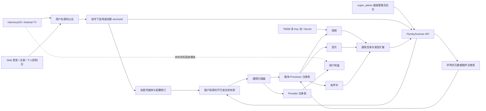

# FlymbyScanner 远端媒体目录服务 Spec规格文档

生成日期：2026-08-14

## 1. 需求概述

FlymbyScanner 是可以通过 Docker 部署的可扩展云端媒体扫描与目录服务。一个服务实例必须支持多个用户，每个用户必须支持多个云端网盘服务。系统只保留用户名和密码这一套用户认证入口，用户名和密码都至少 4 个字符，不再支持 APP 托管、匿名、仅凭服务标记或逐任务临时凭据模式。实例首次使用且尚无超级管理员时必须进入 `/setup` 初始化向导，由部署者现场设置首个超级管理员用户名和密码，不能通过环境变量直接预置账号密码；初始化成功后该入口永久关闭。APP 在添加网盘服务时开启“云端模式”，输入云端地址并登录已有账号或创建新账号；登录成功后可以选择账号下已有云端服务，也可以把当前网盘连接、扫描路径、媒体类型和刮削配置创建为新的云端服务。服务端持久管理加密网盘凭据和版本化配置，统一枚举网盘文件，再按视频、音乐、有声书分流到独立媒体处理器，完成识别、标签/NFO 解析、元数据刮削、目录持久化和实时进度发布，并向 HarmonyOS APP 与 Android TV 提供统一媒体查询接口。内置 TMDB 来源支持通过 Docker 环境变量或 Secret 配置多个 Key，并根据健康 Key 数量动态调整刮削并发；服务同时提供登录、注册、普通用户个人控制台和 `super_admin` 超级管理员后台。普通用户只能管理本人服务、任务和媒体目录，超级管理员可以跨用户管理服务、插件、任务和系统配置。Web 前端不提供直接播放。数据库未配置时默认使用 SQLite，也可通过环境变量切换到 PostgreSQL 或 MySQL。

网盘接入采用可安装 Provider 适配器，媒体处理采用可扩展 Processor/Metadata Provider，不把当前四类网盘或视频字段固化为核心枚举。播放由客户端根据远端目录返回的网盘文件定位信息，使用本地网盘凭据解析最终播放地址。FlymbyScanner 不代理、转码或持久化视频、音乐、有声书媒体流。

## 2. 检查范围

| 项目 | 内容 |
| --- | --- |
| 需求名称 | FlymbyScanner 远端媒体目录服务 |
| 用户最新口径 | 取消 APP 托管模式，统一用户名和密码且二者都至少 4 个字符；首次使用在 `/setup` 设置首个超级管理员账号密码；APP 开启云端模式后输入云端地址，登录已有账号或创建新账号，再选择已有云端服务或把当前服务创建为新云端服务；服务端持久管理连接、扫描和刮削配置；TMDB 可配置多个 Key，并按 Key 数量动态调整刮削并发；Web 前端提供登录、注册、普通用户个人控制台和 `super_admin` 超级管理员后台，支持服务管理、扫描触发、插件配置、实时进度和无播放海报墙；覆盖视频、音乐、有声书及更多网盘扩展；APP 直接播放 |
| 新项目 | `/Users/shijianting/WebstormProjects/FlymbyScanner` |
| HarmonyOS 代码依据 | `/Users/shijianting/WebstormProjects/flymby` |
| Android TV 代码依据 | `/Users/shijianting/DevecostudioProjects/flymby2/androidtv` |
| 音乐刮削代码依据 | `/Users/shijianting/WebstormProjects/FlymbyServer` |
| 首批网盘 | WebDAV、光鸭、阿里云盘、百度网盘；协议和数据库必须允许后续增加 Provider |
| 内置媒体类型 | `video`、`music`、`audiobook`；协议允许通过版本升级增加新的媒体处理器 |
| 服务端接口 | 当前为方案契约，尚未实现 |
| 交付范围 | 方案文档，不修改 Flymby 或 Android TV 业务代码 |

## 3. 当前代码依据

| 模块 | 当前依据 | 结论 |
| --- | --- | --- |
| 统一网盘类型 | `main/src/main/ets/cloud-drive/model/CloudDriveModels.ets` | 当前客户端定义四类联合类型；服务端协议不能照搬为封闭枚举 |
| 网盘路由 | `main/src/main/ets/cloud-drive/provider/CloudDriveProviderRegistry.ets` | 可作为 Provider 注册边界参考，但服务端需要能力描述和适配器版本 |
| 现有扫描主流程 | `main/src/main/ets/webdav/service/WebDavScanService.ets` | 当前以视频、NFO、TMDB/插件为中心，包含断点、增量和落库；通用扫描层与视频处理层需要拆开 |
| 扫描路径 | `main/src/main/ets/webdav/util/WebdavVideoLibraryScanPathUtil.ets` | WebDAV 使用路径，API 型网盘需保留 `resourceId + displayPath` |
| 刮削源绑定 | `main/src/main/ets/webdav/page/helper/WebdavVideoMetadataProviderSettingHelper.ets` | 当前按服务实例选择刮削源 |
| 失败重试来源 | `main/src/main/ets/webdav/page/helper/WebdavVideoRetryMetadataProviderSettingHelper.ets` | 全量/增量来源与失败重试来源分离 |
| APP 服务唯一 ID | `main/src/main/ets/viewmodel/ServerInfoData.ets` | 已有 `serverId` 且注释为“服务唯一ID”；它只用于设备内服务实例和云端服务的绑定别名，不再作为服务端媒体库归属主键 |
| APP 服务 ID 保留 | `main/src/main/ets/utils/ServerInfoTimestampUtil.ets` | 编辑时保留原 `serverId`，可维持本地绑定；服务端统一生成 `serviceId` 和 `libraryId`，新设备通过账号下的服务列表选择，不依赖复制本地 ID |
| 声明式插件 | `main/src/main/ets/plugin/video-metadata` | 当前只覆盖视频，安全宿主规则可复用，Manifest 需要增加媒体类型和能力声明 |
| 本地目录 | `common/src/main/ets/webdav/local/WebdavLocalStore.ets` | 当前媒体、剧集、文件关联和缓存全部在 APP 本地 |
| HarmonyOS 首页 | `main/src/main/ets/webdav/fragment/WebDavVideoHome.ets` | 直接读取 `WebdavLocalStore`，需改为目录 Repository |
| HarmonyOS 详情 | `main/src/main/ets/webdav/page/WebdavVideoDetailPage.ets` | 直接读取剧集和文件关联，需支持远端目录 |
| 客户端媒体类型 | `main/src/main/ets/pages/download/AddDownloadPage/index.ets` | 已使用 `video`、`music`、`audiobook`，可作为首批通用媒体类型口径 |
| 本地音频识别 | `common/src/main/ets/localmedia/LocalMediaConstants.ets` | 已有音视频扩展名集合，可作为文件分类参考，不能代替服务端媒体探测 |
| 音频播放 | `common/src/main/ets/audio/AudioService.ets` | 音乐和有声书最终仍进入客户端音频播放链路，不由扫描服务播放 |
| FlymbyServer 音乐聚合 | `FlymbyServer/backend/app/audio_scraper.py` | 已实现 `auto/musicbrainz/netease/qmusic/kugou/migu/kuwo` 来源、`fast/complete` 聚合、候选字段统一、MusicBrainz 限流和来源失败隔离；FlymbyScanner 可迁移领域方法，不应默认调用其线上接口 |
| FlymbyServer 音乐来源适配 | `FlymbyServer/backend/app/audio_metadata_sources.py` | 各来源通过隔离适配器转换为相同字段，适合作为 FlymbyScanner `MusicMetadataProvider` 注册表和标准化层参考 |
| FlymbyServer 声纹识别 | `FlymbyServer/backend/app/audio_scraper.py`、`backend/app/main.py` | 当前上传受限音频到临时文件，由 `fpcalc` 生成 Chromaprint，再向 AcoustID 查询并回查 MusicBrainz；临时文件在成功或失败后删除，适合作为低置信度曲目的可选后备能力 |
| FlymbyServer 音乐配置与前台 | `FlymbyServer/backend/app/config.py`、`backend/.env.example`、`app/pages/admin/tools/audio-scrape.vue` | 已有 AcoustID、fpcalc、MusicBrainz User-Agent、上传上限、上游超时和能力展示，可复用配置边界与管理交互，但认证和 API 契约需按 FlymbyScanner 重建 |
| Android TV 服务类型 | `androidtv/core/model/.../ServiceModels.kt` | 当前没有 WebDAV、光鸭、阿里云盘和百度网盘 |
| Android TV 播放 | `androidtv/core/player-api/.../PlaybackModels.kt` | `PlaybackRequest` 已支持 URI 和 Headers，可接收网盘解析结果 |

## 4. 最新口径与范围边界

### 4.1 明确包含

1. Docker 部署的视频、音乐、有声书扫描和媒体目录服务。
2. APP 添加网盘时可开启“云端模式”并填写云端地址。
3. 添加时校验服务身份、协议版本、服务状态和网盘支持能力，并以用户名和密码登录已有账号或创建新账号。
4. 登录后列出当前账号有权访问的云端服务；用户可选择已有服务，或将 APP 当前网盘连接、扫描路径、媒体类型和刮削配置创建为新的云端服务。
5. 服务端长期加密保存云端扫描所需的网盘凭据，并对连接、扫描和刮削配置进行版本管理；后续扫描只引用 `serviceId` 和冻结的配置修订。
6. 任务暂停、继续、取消、重新授权、检查点恢复和 SSE 实时事件。
7. 扫描结果边落库边查询，支持首页、列表、详情、子项、文件、搜索和增量变更；子项可表示剧集、曲目或章节。
8. 目录备份/快照导出，不包含网盘凭据。
9. HarmonyOS APP 和 Android TV 作为目录消费端。
10. Provider 注册、能力协商和版本管理，允许后续增加网盘而不修改扫描核心。
11. 媒体处理器注册和能力协商，视频、音乐、有声书共享扫描基础设施但保留各自领域模型。
12. 多用户、多设备和多网盘服务的数据归属：认证租户下每个服务端 `serviceId` 只对应一个远端媒体库，客户端服务 ID 只用于设备绑定。
13. TMDB Key 池通过 Docker 环境变量配置，并允许使用 Docker Secret 文件覆盖明文环境变量；刮削并发随健康 Key 数量动态变化并受全局上限保护。
14. 同镜像提供 Web 前端，包含首次使用初始化向导、统一登录入口、普通用户注册入口、个人控制台和超级管理员后台；普通用户只访问本人数据，超级管理员可以跨用户管理。
15. 超级管理员可从前台导入、预检、配置、启用、停用和升级声明式元数据插件。
16. 未配置数据库类型时默认使用 SQLite；通过环境变量可选择 PostgreSQL 或 MySQL，三种数据库共享同一业务模型和迁移版本。
17. 音乐处理器参考 FlymbyServer 已有多来源聚合与可选声纹识别方法，形成 FlymbyScanner 内部可扩展实现，不把 FlymbyServer 线上 API 设为必需依赖。
18. 普通用户个人控制台可管理本人的云端服务、媒体库和任务；所有跨租户管理访问都需要 `super_admin` 权限并写入审计日志。
19. Web 前端通过 SSE 实时展示扫描与刮削阶段、计数、当前媒体类型、进度和脱敏错误。
20. 普通用户按自己的服务、媒体库和媒体类型浏览海报墙；超级管理员可按用户、服务、媒体库和媒体类型浏览全局只读海报墙。
21. Web 前端不提供播放器、播放按钮、媒体代理、临时播放 URL 或网盘凭据查看能力。

### 4.2 明确不包含

1. APP 托管扫描、无账号访问、仅 API Token/配对码访问，以及每次扫描重新上送临时网盘凭据。
2. 视频或音频代理、转码、切片、CDN 分发和媒体文件持久化。
3. 跨用户媒体目录搜索、公开海报墙、公开分享和播放链接分享。
4. 执行由扫描任务临时上送的 ArkTS、JavaScript、HAR、HSP 或本地二进制代码。Provider 适配器只能由超级管理员安装受信任版本，不能由普通 APP 请求动态注入。
5. 元数据内容的法律专项评估，本阶段不展开，后续统一处理。
6. 通过管理前台导入 Provider 适配器、脚本、动态链接库或其他可执行插件。
7. 在 Web 前端直接播放、预览、代理或下载用户媒体文件。
8. 管理员在 Web 前端查看网盘密码、Token、Cookie 明文，或修改运行中任务已经冻结的配置快照。
9. 无认证的公开海报墙、跨用户公开搜索或公开媒体详情页。

## 5. 角色与主流程

| 角色 | 职责 |
| --- | --- |
| APP 用户 | 添加网盘、开启云端模式、注册或登录、选择已有服务或创建新服务、发起任务 |
| Web 普通用户 | 从登录或注册入口进入个人控制台，只管理本人云端服务、扫描任务和媒体目录；不直接播放 |
| HarmonyOS APP | 管理本地播放授权、绑定云端服务、查询目录、触发扫描和直接播放 |
| Android TV | 使用用户名和密码登录、选择云端服务、查询目录、使用本地网盘授权直接播放 |
| FlymbyScanner API | 用户名密码认证、确定租户、管理云端服务及加密凭据、任务编排、目录查询和变更发布 |
| 扫描 Worker | 通过 Provider 枚举网盘、识别媒体类型、调用媒体处理器并事务落库 |
| 超级管理员 | 使用 `super_admin` 角色进入全局管理后台，创建/管理用户和任意租户的云端服务，维护服务配置、触发扫描、配置声明式插件、查看全局任务和海报墙；不得查看网盘凭据明文或直接播放 |

主流程：

1. APP 先完成当前网盘的本地添加或授权，然后为该服务开启“云端模式”并填写云端地址。
2. APP 请求 `/api/v1/system/info`，校验 `serviceInstanceId`、协议版本、服务状态及当前 Provider 能力。
3. 已有账号的用户输入用户名和密码登录；没有账号的用户选择“新建账户”，输入用户名、密码和确认密码完成注册并自动登录。
4. 服务端从登录态确定 `userId + tenantId`，不接受 APP 自行指定用户或租户。
5. APP 进入云端服务选择页，按当前 `providerType` 列出账号下已有服务。用户可选择一个已有服务，也可选择“将当前服务创建为新的云端服务”。
6. 选择已有服务时，服务端校验用户权限和 Provider 类型，建立 `clientServiceId -> serviceId` 客户端绑定，不覆盖云端连接及扫描/刮削配置。
7. 创建新服务时，APP 一次性提交当前网盘连接、扫描路径、媒体类型和刮削配置；服务端验证连接，加密保存凭据，生成 `serviceId + libraryId` 和首个配置修订，再建立客户端绑定。
8. 用户或超级管理员触发扫描时只提交 `serviceId + requestId + scanMode`。服务端锁定该服务当前的凭据、扫描配置、刮削配置和插件配置修订，生成不可变任务快照并返回 `jobId`。
9. Worker 统一枚举文件，并按媒体类型路由到视频、音乐或有声书处理器。
10. Worker 按一个可查询媒体聚合提交主条目、子项、关系和文件定位。
11. 服务端递增 `catalogVersion`，通过 SSE 通知同一租户下有权访问该服务媒体库的客户端。
12. 客户端查询远端目录，按本地播放记录组装继续观看或继续收听。
13. 播放时客户端使用 `playbackLocator` 和本地网盘授权获取最终 URL；服务端网盘凭据不得下发。
14. 云端凭据失效时，服务进入 `reauthorization_required`；用户在 APP 或管理前台更新服务连接，验证成功并生成新凭据修订后，再发起或重试扫描。
15. 普通用户在个人控制台查看本人服务的任务进度；超级管理员可选择任意用户和服务查看扫描/刮削阶段与实时进度。
16. 已提交的目录条目立即进入对应媒体库海报墙；普通用户只能浏览本人目录，超级管理员可跨用户查看只读详情，但页面不生成播放请求。
17. 超级管理员对用户角色、服务和插件配置的变更写入审计日志，且不改变历史任务的冻结配置快照。



## 6. APP 云端模式规格

### 6.1 界面与字段

| 字段/控件 | 规格 |
| --- | --- |
| 云端模式 | 按每个网盘服务实例保存，非全局开关 |
| 云端地址 | 开启后必填，保存基础 URL；只进行必要的尾斜杠处理，不改变路径大小写或业务参数 |
| 服务状态 | 未检测、检测中、可用、协议不兼容、不支持当前网盘、不可用 |
| 检测按钮 | 不上送网盘凭据，只请求服务信息 |
| 已有账户 | 输入用户名和密码；两项都至少 4 个字符，登录成功后进入服务选择页 |
| 新建账户 | 输入至少 4 个字符的用户名、至少 4 个字符的密码、确认密码，以及部署策略要求时的注册码；注册成功后自动登录 |
| 服务选择 | 列出当前账号下有权访问的已有云端服务，默认按当前 Provider 筛选，不兼容服务只读展示原因且不可选择 |
| 新建云端服务 | “将当前服务创建为新的云端服务”，明确提示会把当前连接、扫描路径和刮削配置保存到云端 |
| 提示文案 | 说明扫描、刮削和目录在云端；播放仍由 APP 本地连接网盘，新设备需要另外完成本地播放授权 |

### 6.2 APP 持久化字段

| 字段 | 类型 | 说明 |
| --- | --- | --- |
| `serverId` | string | APP 现有网盘服务稳定 ID，在绑定请求中作为 `clientServiceId`；仅表示本地服务别名 |
| `cloudModeEnabled` | boolean | 是否启用云端目录 |
| `cloudServiceUrl` | string | 云端服务基础地址 |
| `cloudServiceInstanceId` | string | FlymbyScanner 部署实例稳定 ID，对应服务端 `serviceInstanceId` |
| `cloudProtocolVersion` | number | 上次验证的协议版本 |
| `cloudServiceId` | string | 账号下选中或新建的云端服务 ID |
| `cloudLibraryId` | string | 该云端服务对应的媒体库 ID，可缓存但不能作为授权依据 |
| 登录凭据 | 安全存储 | 不持久化密码；APP 只在系统安全存储中保存访问令牌和刷新令牌 |

### 6.3 保存规则

1. 开启云端模式后，云端地址必填；进入下一步前必须完成服务检测。
2. 服务检测成功后进入账户步骤，不能跳过用户名和密码认证。
3. 登录或注册成功后才进入服务选择步骤；APP 不允许通过 `serviceId`、`libraryId` 或本地备份绕过登录。
4. 选择已有服务只建立客户端绑定，不把当前 APP 的网盘连接、扫描路径或刮削配置覆盖到云端。
5. 创建新云端服务前必须同时验证 APP 当前网盘连接和云端服务；创建成功后保存服务端返回的 `serviceId + libraryId`。
6. 修改云端地址后立即清除页面检测、登录和服务选择状态。
7. 新旧地址返回相同 `serviceInstanceId` 时可以保留已缓存登录态和绑定；实例 ID 变化时必须清空登录态与激活绑定，不自动删除旧实例数据。
8. 关闭云端模式不删除云端服务和目录，但需提示本地没有完整目录时海报墙可能为空。
9. 编辑现有 APP 网盘服务时保留 `serverId` 和已有绑定；复制本地服务不得自动绑定原 `serviceId`，必须重新登录后显式选择或创建。
10. 新设备输入云端地址、用户名和密码后，从账号服务列表选择目标 `serviceId`；禁止根据网盘账号、地址、名称或路径自动猜测并合并。
11. 新设备若要播放，还必须在本地添加或授权与所选 `providerType` 匹配的网盘服务；没有本地播放授权时允许浏览目录，但播放入口应明确提示“未完成本地播放授权”。

### 6.4 多用户与服务归属模型

| 标识 | 产生方 | 是否由 APP 上送 | 用途 |
| --- | --- | --- | --- |
| `serviceInstanceId` | FlymbyScanner 部署实例 | APP 从 `/system/info` 获取后回传或本地校验 | 区分不同 FlymbyScanner 部署，防止地址变化或切换实例时误用旧绑定 |
| `tenantId` | FlymbyScanner 认证系统 | 否 | 数据所有权和权限边界；必须从访问令牌或服务端会话得到 |
| `serviceId` | FlymbyScanner | 创建后返回 | 账号下一个云端服务的规范身份，是连接、配置、任务和目录的归属主键 |
| `libraryId` | FlymbyScanner | 创建后返回 | 由 `serviceId` 独占的媒体库资源 ID，用于目录、事件和导出路径 |
| `clientServiceId` | APP | 绑定时上送 | 标识某设备中的本地网盘服务实例，只用于建立客户端绑定和播放关联，不决定云端归属 |

FlymbyScanner 部署内部维护 `tenantId + serviceId + libraryId` 的所有权链：`serviceId` 和 `libraryId` 均由服务端生成，一个 `serviceId` 独占一个 `libraryId`。`clientServiceId` 存放于独立 `client_service_link` 中，同一云端服务可以被同一账号的多台设备分别绑定。跨部署的完整作用域为 `serviceInstanceId + tenantId + serviceId`。

归属规则：

1. `tenantId` 只能从认证上下文取得。请求体或查询参数即使出现 `tenantId` 也不得作为授权依据，建议直接拒绝该字段。
2. 当前账号只能列出和选择其 `tenantId` 有权访问的云端服务，选择时仍需校验 `providerType`。
3. 多设备通过账号服务列表选择同一 `serviceId`，自然共享同一 `libraryId`；不要求各设备复制相同 `clientServiceId`。
4. 同一租户可以创建多个配置相同的云端服务；只要 `serviceId` 不同，就必须保持媒体库、任务和配置独立。
5. 显示名称、Provider 账号、连接 URL、用户名、Token、扫描路径和根资源 ID 均不能用作媒体库归属键。
6. 已建立客户端绑定后若本地或云端 `providerType` 不一致，返回 `409`，不得静默改绑或改变云端服务类型。
7. `serviceId` 负责云端归属，`clientServiceId` 负责设备本地关联，`libraryId` 负责目录定位；三者都不能单独代表访问权限。
8. 所有媒体库、任务、SSE、目录、缓存、对象存储和导出访问都必须先校验当前 `tenantId` 的所有权。
9. 跨租户导入备份不得接管原 `libraryId`；目标租户应建立新的服务绑定。后续若支持所有权转移，必须使用独立的显式转移协议。

客户端绑定已有云端服务请求示例：

```json
{
  "clientServiceId": "local-service-id",
  "clientDeviceId": "device-id",
  "providerType": "aliyundrive"
}
```

请求路径为 `/api/v1/services/01943f4a-5f2e-7c2c-ae30-5f5e2e60fc91/client-bindings`。服务端从认证上下文取得 `tenantId`，返回：

```json
{
  "serviceId": "01943f4a-5f2e-7c2c-ae30-5f5e2e60fc91",
  "libraryId": "01943f4b-2479-78a3-a3ee-f0ce79b59048",
  "bindingId": "01943f4c-33b5-72ec-b8a0-a9480f9be746",
  "catalogVersion": 123
}
```

## 7. 云端服务配置与任务快照

### 7.1 创建云端服务示例

```json
{
  "displayName": "我的阿里云盘电影库",
  "clientDeviceId": "device-id",
  "clientServiceId": "local-service-id",
  "provider": {
    "type": "aliyundrive",
    "connection": {
      "accessToken": "secret-uploaded-once",
      "refreshToken": "secret-uploaded-once",
      "driveIds": ["resource-drive-id"]
    }
  },
  "scan": {
    "mode": "incremental",
    "mediaTypes": ["video", "music", "audiobook"],
    "roots": [
      {
        "resourceId": "folder-id",
        "displayPath": "/媒体",
        "driveId": "resource-drive-id",
        "mediaTypes": ["video", "music", "audiobook"]
      }
    ],
    "removedRootPolicy": "protect"
  },
  "metadata": {
    "profiles": {
      "video": {
        "processorVersion": 1,
        "ignoreNfo": false,
        "providerId": "builtin.tmdb",
        "retryProviderId": "builtin.tmdb",
        "language": "zh-CN",
        "region": "CN",
        "rescrapePolicy": "changed_only"
      },
      "music": {
        "processorVersion": 1,
        "embeddedTags": true,
        "providerId": "auto",
        "aggregateMode": "fast",
        "requiredFields": {
          "artist": true,
          "album": true,
          "cover": true
        },
        "fingerprintPolicy": "fallback",
        "rescrapePolicy": "changed_only"
      },
      "audiobook": {
        "processorVersion": 1,
        "embeddedTags": true,
        "providerId": null,
        "rescrapePolicy": "changed_only"
      }
    }
  }
}
```

服务端验证连接成功后，为此服务生成 `serviceId + libraryId`，把连接 Secret 写入独立凭据库，把扫描和刮削配置写入版本化配置表，并返回不含 Secret 的摘要。

### 7.2 触发扫描示例

```json
{
  "requestId": "device-generated-id",
  "clientDeviceId": "device-id",
  "scanMode": "incremental"
}
```

请求路径为 `/api/v1/services/{serviceId}/scan-jobs`。请求不得再次携带网盘密码、Token、Cookie、扫描根或刮削配置。

### 7.3 配置与快照规则

1. 云端服务保存连接配置、扫描配置和刮削配置的独立修订；Secret 与非敏感配置分表保存。
2. 用户修改服务配置时生成新修订，不覆盖历史修订；运行中任务不读取当前可变配置。
3. 服务端必须先校验 `tenantId + serviceId + libraryId` 所有权链；不匹配时不得创建任务。
4. 同一租户的同一 `serviceId` 同时只允许一个改变目录的任务。
5. 相同 `(tenantId, clientDeviceId, requestId)` 必须返回同一任务，避免设备重复点击；不同租户的相同请求 ID 互不影响。
6. 入队时冻结 `credentialRevision + scanProfileRevision + metadataProfileRevision + Provider/Processor/插件版本及 configurationRevision`，任务开始后不可修改。
7. 凭据失效时服务状态变为 `reauthorization_required`，当前任务以可识别错误暂停或失败；APP 或管理前台必须先更新服务连接并生成新凭据修订，再显式重试或新建任务，不能向旧任务补交临时凭据。
8. 服务端按 Provider 和媒体处理器能力校验任务；不支持的组合必须在入队前返回明确错误。
9. `mediaTypes` 未填写时不得默认为仅视频，需由协议默认值或 APP 显式值决定并记录快照版本。
10. 服务端将实际选中的 Provider 适配器、媒体 Processor、元数据来源版本，以及声明式插件 ID、版本、SHA-256 和 `configurationRevision` 写入任务快照，恢复任务时不得静默切换版本或配置修订。
11. TMDB Key 池属于部署运行容量，不冻结某个 Key 到业务任务。每次任务执行尝试只记录不含敏感值的 `tmdbKeyPoolRevision` 便于诊断；具体 Key 由调度器逐请求选择，任务恢复时可以使用当前健康池。

## 8. 扫描和删除保护规则

1. 基线维度为 `tenantId + libraryId + providerType + rootResourceId`；任何查询或对账不得省略租户范围。
2. WebDAV 使用规范化路径作为稳定身份。
3. 光鸭、阿里云盘、百度网盘优先使用稳定文件 ID，不以展示路径作为唯一身份。
4. 先比较 ETag/版本，其次比较 `size + modifiedMs`，必要时再计算内容指纹。
5. 只有新增或变更文件进入媒体识别、标签/NFO、刮削和失败修正队列。
6. 整个扫描根的当前 generation 成功完成后，才允许将未出现文件标记为缺失。
7. 任一目录或分页读取失败时，不执行当根缺失清理。
8. APP 未上送某个旧根时默认 `removedRootPolicy=protect`，不删除对应目录。
9. 删除扫描根与删除根下媒体必须是独立显式操作。

### 8.1 Provider 扩展规则

1. `provider.type` 是稳定字符串标识，不使用数据库原生枚举或核心代码中的穷举分支限制新 Provider。
2. 每个 Provider 通过注册表暴露 `adapterVersion`、`credentialSchemaVersion` 和能力集合，至少区分列目录、分页、读取小文本、Range 读取、稳定资源 ID、变更游标和播放定位。
3. Provider 连接字段由版本化 schema 校验；核心任务只持有密文引用，不理解各网盘 Token 细节。
4. 新 Provider 必须通过统一错误模型返回凭据过期、限额、权限不足、资源不存在和临时网络错误。
5. 服务端安装扫描适配器不代表客户端已经具备播放能力；`/system/info` 必须分别声明服务端扫描能力和客户端所需播放定位 schema。
6. 首批内置 `webdav`、`guangya`、`aliyundrive`、`baidupan`，后续 Provider 以新增适配器和能力描述接入，不修改 `media_item` 主模型。

### 8.2 媒体类型扩展规则

1. 首批 `mediaType` 为 `video`、`music`、`audiobook`；`itemType` 使用带领域前缀的稳定值，例如 `video.movie`、`music.album`、`audiobook.book`。
2. 通用层只负责文件枚举、基线、检查点、删除保护、任务状态和文件定位；文件分类后交给对应媒体处理器。
3. 视频处理器负责电影、剧集、季集关系、NFO 和视频元数据；音乐处理器负责艺术家、专辑、曲目、唱片号、内嵌标签、多来源候选匹配和可选声纹识别；有声书处理器负责作品、作者、演播者、章节、分卷和时长。
4. 一个扫描根可以允许多种媒体类型，未知文件保留为 `source_file` 诊断记录，不强行归入视频。
5. 新媒体类型通过 Processor、目录投影和查询能力扩展；通用 API 不因新增类型改变路径。
6. 客户端遇到尚不认识的 `mediaType` 或 `itemType` 时忽略对应分区并保留目录版本推进，不得导致整个媒体库不可用。

## 9. 刮削和插件规格

| 规则 | 说明 |
| --- | --- |
| 视频内置来源 | 首期保留 NFO 与 `builtin.tmdb` |
| 音乐内置解析 | 读取文件/目录信息和内嵌标签；参考 FlymbyServer 接入 MusicBrainz、网易云音乐、QQ音乐、酷狗音乐、咪咕音乐、酷我音乐的适配与聚合方法，并将 Chromaprint/AcoustID 作为可选后备能力 |
| 有声书内置解析 | 读取文件/目录信息、内嵌标签、章节和分卷规则，外部书籍元数据源待确认 |
| 自定义来源 | 使用声明式 `media_metadata` Manifest，并声明 `supportedMediaTypes`、字段能力和版本；兼容现有 `video_metadata` 语义 |
| 执行边界 | 宿主控制 HTTP，不加载第三方代码 |
| 安全校验 | HTTPS、域名允许列表、方法、超时、响应大小、并发和请求间隔 |
| 能力声明 | `supportedFields` 表示潜在能力，`providedFields` 表示实际返回字段 |
| 缺失字段 | 保持空/未知，不伪造评分、年份、外部 ID 或图片 |
| 失败策略 | 元数据来源失败不跨媒体类型回退；按该媒体 Profile 上送的失败重试来源执行 |
| 更换来源 | APP 显式选择 `changed_only`、`failed_only` 或 `all` |

插件必须禁止请求回环、内网、链路本地和云主机元数据地址，防止 SSRF。不得将网盘凭据、用户身份或完整原始路径注入插件请求。

声明式元数据 Manifest 与 Provider 适配器属于不同扩展面：前者不能执行代码；后者是超级管理员显式安装、锁定版本并纳入供应链审计的服务端组件，不能由单次扫描任务上传。

### 9.1 TMDB 多 Key 池与动态并发规格

| 配置项 | 默认值 | 规则 |
| --- | --- | --- |
| `FLYMBYSCANNER_TMDB_API_KEYS` | 无 | 逗号分隔的多个 TMDB Key；仅在未配置 Secret 文件时读取，不写入数据库、插件包、备份或前台表单 |
| `FLYMBYSCANNER_TMDB_API_KEYS_FILE` | 无 | 指向 Docker Secret 挂载文件，每行一个 Key；同时配置时文件具有更高优先级，不与环境变量合并 |
| `FLYMBYSCANNER_TMDB_CONCURRENCY_PER_KEY` | `1` | 单个健康 Key 同时允许的 TMDB 请求数；必须为正整数，实施时限制安全上限 |
| `FLYMBYSCANNER_TMDB_MAX_CONCURRENCY` | `32` | 当前部署全部 Worker 的 TMDB 请求总并发上限；必须为正整数，防止 Key 数量过多拖垮网络、CPU、数据库和上游 |

配置规则：

1. 服务启动时读取 Key 池。环境变量中的值按逗号拆分，Secret 文件按行拆分；只去除每项首尾空白并忽略空项，完全相同的 Key 只保留一份，重复项不能增加并发。环境变量或 Secret 文件变化后需要重启 API/Worker 才能形成新的 `tmdbKeyPoolRevision`。
2. Key 状态至少包含 `healthy`、`cooldown` 和 `disabled`。新加载且格式通过基础校验的 Key 初始为 `healthy`；Key 原文、局部字符、哈希或可反推标识均不得写入日志、数据库、任务快照和 API。
3. TMDB 实际并发按以下公式实时计算：`effectiveConcurrency = min(TMDB_MAX_CONCURRENCY, healthyKeyCount × TMDB_CONCURRENCY_PER_KEY, workerAvailableSlots)`。健康 Key 数量、Worker 可用槽位或配置修订变化时，调度器立即重新计算，不中断已经发出的请求。
4. 请求优先分配给“在途请求数最少且未处于冷却”的 Key；在途数相同时使用轮询，避免总是消耗第一个 Key。不同用户和任务进入公平队列，单一媒体库不能长期占满整个 Key 池。
5. 某个 Key 收到明确的认证/授权失败时，将该 Key 标记为 `disabled`，直到重启加载新配置；收到限流响应时，只将该 Key 置为 `cooldown`，优先遵循上游返回的等待时间，没有明确等待时间时使用有上限的退避。网络错误或上游 5xx 不直接永久禁用 Key。
6. Key 进入 `cooldown/disabled` 后立即从 `healthyKeyCount` 移除并降低新请求并发；冷却结束后可重新进入健康池。重试必须继续受任务重试次数、全局并发和公平队列限制，不能因切换 Key 产生无限重试或重复落库。
7. 未配置任何 Key 时服务仍可启动，但 `builtin.tmdb` 状态为 `unavailable`；所有 Key 暂时冷却时状态为 `degraded` 并等待最早恢复时间；所有 Key 均禁用时状态为 `unavailable`。TMDB 不可用不得影响 NFO、内嵌标签和已启用插件，也不得触发目录误删除。
8. 多 Worker 部署必须使用部署级共享信号量和 Key 状态，确保 `TMDB_MAX_CONCURRENCY` 是整个部署的上限；未提供分布式协调组件时，只允许一个 TMDB 元数据调度器工作，不能把上限按 Worker 副本数放大。
9. API 与 Worker 必须读取同一 `tmdbKeyPoolRevision`；修订不一致时健康检查失败并停止接受新的 TMDB 任务，避免 API 计算的能力与 Worker 实际 Key 池不一致。
10. 普通 `/system/info` 只返回 `builtin.tmdb` 的 `available/degraded/unavailable`，不暴露 Key 数量和容量。管理前台配置状态页可展示配置来源、`configuredKeyCount`、`healthyKeyCount`、`cooldownKeyCount`、`disabledKeyCount`、`effectiveConcurrency` 和池修订，但不得展示任何 Key。
11. 前台不提供在线修改 TMDB Key 的输入框，防止与 Docker 声明式配置产生双重配置源。旧草案中的单 Key 变量不再作为正式配置项，项目实现只采用复数变量。

### 9.2 音乐元数据处理规格

FlymbyScanner 的音乐元数据处理参考 FlymbyServer `AudioScrapeService` 与 `AudioMetadataSources` 的领域实现，但不直接复用 FlymbyServer 的用户鉴权、加密信封、匿名接口或管理端接口。默认部署必须在 FlymbyScanner Worker 内完成处理，避免 FlymbyServer 不可用时阻塞扫描，也避免把租户文件信息转发到另一业务服务。

处理规则：

1. 扫描器先从文件名、目录名和内嵌标签得到 `title`、可选 `artist/album/albumArtist`、轨号、碟号和时长，生成标准化检索请求；已有完整且可信标签时允许只补缺失字段。
2. 文字检索是批量扫描的主路径。内置来源 ID 参考 FlymbyServer，首批候选为 `auto`、`musicbrainz`、`netease`、`qmusic`、`kugou`、`migu`、`kuwo`；来源必须通过 `MusicMetadataProvider` 注册表接入，不能在 Processor 中写死请求分支。
3. `auto` 支持 `fast` 与 `complete`：`fast` 并发查询已启用来源，采用第一个满足必要字段的有效来源后取消其余任务；`complete` 等待各来源结束，再按来源轮询合并候选，避免单一来源占满结果。
4. `fast` 的必要字段首期只包含 `artist`、`album`、`cover`。来源未返回必要字段时继续等待其他来源；单个来源失败只写入脱敏 `sourceWarnings`，不使其他来源的有效结果失败。
5. 所有适配器统一输出 `id`、`source`、`sourceName`、`sourceOfficial`、`matchScore`、`title`、`artist`、`album`、`albumArtist`、`releaseDate`、`year`、`durationMs`、`trackNumber`、`discNumber`、`genres`、`cover`、`identifiers` 和 `providedFields`。来源专属 ID 只放入 `identifiers`，目录层不依赖某个平台字段。
6. 匹配分数综合标题、艺术家、专辑、时长、轨号和已有外部 ID。高于自动采用阈值的候选才更新目录；中间区间保存为 `needs_review` 候选；低于拒绝阈值或无候选时保留本地标签结果，不允许仅因返回顺序自动选中。具体阈值在实施前冻结。
7. MusicBrainz 请求沿用独立串行限流，默认至少间隔 1.05 秒；其他来源分别维护并发、超时、熔断和短时缓存。能力接口必须返回每个来源的 `available/degraded/unavailable` 状态和不含敏感内容的原因码。
8. 声纹识别只作为文字检索失败、低置信度或用户显式要求时的后备路径，不对扫描到的全部音乐文件自动执行。Worker 使用任务快照锁定的服务凭据修订，读取受大小限制的音频到独立临时目录，调用 `fpcalc` 生成 Chromaprint，只向 AcoustID 提交声纹和时长，再根据 Recording ID 查询 MusicBrainz。
9. 声纹临时文件在成功、失败、取消或进程恢复清理时删除，不写入数据库、目录导出或长期对象存储；日志不得记录音频正文、声纹、AcoustID Key、完整原始路径或网盘请求头。
10. 未安装 `fpcalc` 或未配置 AcoustID Key 时，服务正常启动且文字检索继续可用；能力接口将声纹标记为 `unavailable`，任务不得在运行到一半后才以未知错误失败。
11. FlymbyServer 现有 `/api/v1/tools/audio-scrape/*` 仅作为代码与交互参考，不是 FlymbyScanner 首期依赖。以后若需要将其作为远程元数据来源，应通过独立声明式 Provider 接入，并按租户、限额和故障隔离重新设计。

音乐相关部署配置：

| 配置项 | 默认值 | 规则 |
| --- | --- | --- |
| `FLYMBYSCANNER_MUSIC_METADATA_SOURCES` | `musicbrainz` | 逗号分隔的内置来源 ID；`auto` 只聚合这里启用且能力正常的来源，非法 ID 启动失败 |
| `FLYMBYSCANNER_MUSICBRAINZ_USER_AGENT` | 无 | 启用 MusicBrainz 时必填，使用明确的应用名称、版本和联系方式 |
| `FLYMBYSCANNER_ACOUSTID_API_KEY` | 无 | 可选声纹能力使用的 Key，不进入数据库、页面、日志、任务快照或导出 |
| `FLYMBYSCANNER_ACOUSTID_API_KEY_FILE` | 无 | 指向 Docker Secret 文件；同时配置时优先读取文件内容 |
| `FLYMBYSCANNER_FPCALC_PATH` | 从 `PATH` 查找 `fpcalc` | 只允许部署配置的固定可执行文件路径，不接受 APP 或任务上送命令 |
| `FLYMBYSCANNER_AUDIO_TEMP_MAX_BYTES` | 实施前冻结 | 限制单个声纹临时文件；超过限制时跳过声纹并保留文字检索结果 |
| `FLYMBYSCANNER_MUSIC_UPSTREAM_TIMEOUT_SECONDS` | `15` | 音乐元数据上游超时，实施时限制在安全范围内 |

### 9.3 声明式插件导入规格

1. 首期前台只导入 `media_metadata` 声明式元数据插件，不导入 Provider 适配器或任意可执行代码。
2. 导入包扩展名使用 `.flymby-plugin`，底层为 ZIP，必须包含 `manifest.json`；Manifest 声明插件 ID、名称、版本、协议版本、支持的媒体类型、允许访问的域名、请求模板、响应映射和字段能力。
3. 插件导入属于 FlymbyScanner 实例级管理能力，只允许 `super_admin` 操作；普通用户只能在任务配置中选择超级管理员已启用的插件。
4. 上传后先进入 `validating`，依次执行文件大小、压缩后大小、文件数量、目录穿越、重复路径、Manifest schema、插件 ID/版本、协议兼容、域名、HTTP 方法和禁止文件类型校验。
5. 包内出现 ArkTS、JavaScript、Java、Kotlin、Python、Shell、HAR、HSP、SO、DLL、可执行文件或符号链接时直接拒绝。
6. 校验通过后计算 SHA-256，展示插件能力、域名和版本差异，管理员确认后再原子安装到持久卷的版本目录。
7. 同一插件版本不可覆盖；升级必须安装新版本。扫描任务快照固定实际插件 ID、版本和 SHA-256，运行中任务不得被新版本替换。
8. 停用插件只影响新任务；被任务快照、缓存或历史目录引用的版本不能直接物理删除。
9. 导入、启用、停用和删除尝试均写入管理员审计日志，但日志不记录插件请求中的用户数据和网盘凭据。
10. Manifest 可声明版本化 `configurationSchema`，首期字段类型限定为 `string`、`secret`、`number`、`boolean` 和 `select`，并声明标题、说明、必填、默认值、范围和选项；前端按 schema 生成配置表单，不执行插件提供的 UI 代码。
11. 首期插件配置作用域为 FlymbyScanner 实例级，只允许 `super_admin` 修改。需要租户级或媒体库级配置时必须后续扩展明确的作用域与权限，不能在单次任务中任意上送插件 Secret。
12. `secret` 字段加密保存且读取接口只返回 `configured=true/false`，编辑时留空表示保持原值；普通字段也必须经过 schema 校验、长度限制和敏感名称检查。
13. 每次保存生成不可变 `configurationRevision`。新任务快照只引用插件 ID、版本、SHA-256 与配置修订号，不复制 Secret；运行中和历史任务继续使用原修订，不被后台编辑漂移。
14. 插件可以声明由安全宿主执行的连接校验动作，但只能访问 Manifest 已批准域名，使用相同的 SSRF、超时、响应大小和限频策略；校验结果不得回显 Secret 或完整请求。
15. 插件配置修改、校验、启停和删除均记录操作人、插件、修订号、结果和时间，不记录字段原值或请求正文。

### 9.4 Web 前端、登录注册与角色规格

Web 静态资源与 API 由同一 FlymbyScanner 部署提供。前端必须同时提供首次使用初始化、普通用户登录、用户注册、个人控制台和超级管理员后台；所有页面仍不支持直接播放。路由为 `/setup`、`/login`、`/register`、`/app` 和 `/admin`：

| 页面 | 能力 |
| --- | --- |
| `/setup` 首次使用向导 | 仅当实例 `initialSetupCompleted=false` 且不存在任何 `super_admin` 时可用，只填写超级管理员用户名、密码和确认密码，用户名和密码至少 4 个字符；不要求初始化凭证，不允许选择其他角色 |
| `/login` 登录页 | 明确提供用户名、密码、“登录”按钮和“注册新用户”入口；两项至少 4 个字符。登录成功后，`user` 进入 `/app`，`super_admin` 进入 `/admin` 或原始授权目标 |
| `/register` 注册页 | 明确提供用户名、密码、确认密码、“注册”按钮和“已有账号，去登录”入口；用户名和密码至少 4 个字符，公开注册固定创建 `user`，页面不得提供角色选择 |
| `/app` 个人概览 | 只汇总当前用户的服务数、媒体库数、运行中/失败任务、媒体数量和 Scanner 能力状态 |
| 个人服务页 | 当前用户创建、查看、编辑、验证、启停和删除自己的云端服务，维护连接/扫描/刮削配置并触发扫描；Secret 只写不读 |
| 个人任务页 | 当前用户按服务、媒体库、媒体类型、状态和时间查看自己的任务及 SSE 实时进度 |
| 个人海报墙 | 只浏览当前用户自己的视频、音乐和有声书；支持搜索、筛选、排序、分页和只读详情，不支持播放 |
| `/admin` 超级管理员概览 | 全局用户数、服务数、媒体库数、运行中/失败任务数，以及 API、Worker、数据库、队列、存储、协议版本和 Provider/Processor 状态 |
| 超级管理员用户页 | 搜索和筛选用户，支持创建普通用户、查看详情、重置密码、授予/撤销受保护角色、启用/停用、撤销会话和受保护删除 |
| 超级管理员服务页 | 按用户、Provider、状态筛选全部云端服务；支持代用户创建/维护服务、触发扫描、启停和受保护删除 |
| 超级管理员任务页 | 按用户、服务、媒体库、媒体类型、状态和时间查看全局任务及 SSE 实时进度 |
| 超级管理员海报墙 | 按用户、服务、媒体库和媒体类型查看全局只读目录，不支持直接播放 |
| 媒体详情页 | 只读展示通用字段、类型扩展、来源、图片、子项关系和文件数量；不展示播放按钮、播放器、临时 URL、网盘 Headers 或可直接播放的 `playbackLocator` |
| 超级管理员配置状态页 | 展示 TMDB Key 池来源、各状态数量、动态有效并发、音乐来源、声纹能力、数据库和插件持久卷状态；Key 原文、连接地址和凭据全部隐藏 |
| 超级管理员插件页 | 列表、详情、导入预检、版本差异、schema 驱动配置、连接校验、配置修订、启用、停用和受保护删除 |
| 超级管理员审计页 | 按操作人、角色、操作类型、目标用户/服务/插件、结果和时间筛选脱敏审计记录 |

实例的持久化 `initialSetupCompleted=false` 时处于 `setup_required`。访问 Web 根路径、`/login`、`/register`、`/app` 或 `/admin` 都跳转 `/setup`；除系统信息、初始化状态和初始化提交外，注册、登录、服务、任务、目录与管理业务接口都拒绝处理。初始化提交必须在数据库事务和初始化锁内同时检查“首次设置未完成”和“当前不存在超级管理员”，原子创建 `super_admin` 并写入 `initialSetupCompletedAt`，只能成功一次；成功后建立安全登录会话并跳转 `/admin`，之后访问 `/setup` 应跳转 `/login` 或返回“初始化已完成”。即使管理员数据被异常删除，也不能自动把已初始化实例重新开放为首次设置状态。初始化请求不要求一次性凭证，因此部署者必须先完成首次设置，再通过反向代理、防火墙或端口映射把实例开放到公网。

登录页和注册页都必须能相互跳转。未登录访问 `/app` 或 `/admin` 时跳转 `/login` 并携带站内安全回跳目标；普通用户访问 `/admin` 或 `/api/v1/admin/*` 必须返回 `403`，不能仅依赖前端隐藏菜单。公开注册请求不得接受 `role`，首个超级管理员只能由首次使用向导创建；后续超级管理员只能由已有超级管理员通过受保护接口授予，并需要二次确认、最近重新认证、撤销目标用户旧会话和完整审计。

用户和服务管理采用软停用与受保护删除：停用阻止新认证或新任务但保留目录；删除前必须展示影响范围并进行二次确认，异步清理目录、任务、导出和临时数据。采用 Cookie 会话时必须启用 CSRF 防护、`HttpOnly`、`Secure` 和合适的 `SameSite`；同时配置 CSP、注册/登录限频和操作审计。反向代理部署时允许另外限制 `/admin` 和 `/api/v1/admin/*` 的来源 IP。

海报墙必须使用管理端专用只读 DTO。即使底层目录实体包含客户端播放所需定位信息，管理接口也必须删除 `playbackLocator`、网盘资源请求头、临时 URL 和凭据引用，避免通过浏览器调试工具绕过“无播放”界面限制。图片只使用已允许的封面/海报地址或服务端缓存，不以媒体文件生成预览片段。

海报墙展示规则：

1. 普通用户海报墙固定使用认证用户的 `tenantId`，不能选择其他用户；超级管理员海报墙先选择目标用户和服务，再选择媒体库与 `video/music/audiobook`，且不允许默认混合多个用户或服务。
2. 视频电影/剧集优先使用纵向海报，音乐专辑和有声书优先使用方形封面；缺图时按媒体类型使用本地占位，不使用媒体帧截图。
3. 卡片至少展示标题、类型、年份或发布日期摘要、匹配状态和最近更新时间；扫描中的新增条目可展示“处理中”状态，但只显示已事务提交的数据。
4. 点击卡片进入只读详情，不以单击、双击、长按、右键或键盘快捷键触发播放、预览或下载。
5. 搜索、facets、排序和分页状态写入前端路由查询参数，刷新或返回时可恢复当前用户、服务、媒体类型和列表位置，但 URL 不包含敏感标识以外的配置值。
6. SSE 只负责通知条目或计数变化；海报墙收到事件后按 `catalogVersion` 增量刷新，不把完整媒体记录塞入事件流。

## 10. 服务端接口规格

### 10.1 系统与能力

#### `GET /api/v1/system/info`

用于 APP 添加网盘服务时检测 FlymbyScanner 身份，不接收网盘凭据。

```json
{
  "service": "flymby-scanner",
  "serviceInstanceId": "scanner-01",
  "protocolVersion": 1,
  "status": "ready",
  "setupRequired": false,
  "supportedMediaTypes": ["video", "music", "audiobook"],
  "providers": [
    {
      "type": "webdav",
      "adapterVersion": "1.0.0",
      "credentialSchemaVersion": 1,
      "capabilities": ["list", "readText", "rangeRead", "pathIdentity", "playbackLocator"]
    },
    {
      "type": "aliyundrive",
      "adapterVersion": "1.0.0",
      "credentialSchemaVersion": 1,
      "capabilities": ["list", "readText", "stableResourceId", "playbackLocator"]
    }
  ],
  "metadataProviders": [
    {"id": "builtin.tmdb", "status": "available", "supportedMediaTypes": ["video"]},
    {"id": "builtin.musicbrainz", "status": "available", "supportedMediaTypes": ["music"]},
    {"id": "builtin.acoustid", "status": "unavailable", "reasonCode": "missing_configuration", "supportedMediaTypes": ["music"]}
  ],
  "features": {
    "firstUseSetup": true,
    "scan": true,
    "metadataProcessing": true,
    "pluginMetadata": true,
    "metadataPluginImport": true,
    "adminConsole": true,
    "userPortal": true,
    "selfRegistration": true,
    "adminUserManagement": true,
    "adminServiceManagement": true,
    "adminJobRealtime": true,
    "adminCatalogBrowse": true,
    "pluginConfiguration": true,
    "webPlayback": false,
    "realtimeEvents": true,
    "catalogQuery": true,
    "catalogExport": true
  }
}
```

示例只展示两个网盘 Provider 和部分元数据来源；实际响应必须列出当前实例已安装且启用的全部 Provider、适配器版本和能力。实例未初始化时返回 `status=setup_required`、`setupRequired=true`，只需提供完成初始化所需的最小协议信息，不暴露运行配置。普通 `metadataProviders` 可以返回可用状态和不含敏感信息的原因码，但不得返回 TMDB Key 数量、并发容量、TMDB/AcoustID Key、Secret 文件路径、User-Agent 联系信息或插件内部凭据；TMDB Key 池统计只允许 `super_admin` 通过配置状态接口读取。

### 10.2 首次使用初始化与账号认证

| 方法 | 路径 | 用途 |
| --- | --- | --- |
| GET | `/api/v1/setup/status` | 返回 `setupRequired`，不返回现有超级管理员用户名、数量或其他账号信息 |
| POST | `/api/v1/setup/super-admin` | 仅在 `initialSetupCompleted=false` 且不存在 `super_admin` 时，使用用户名、密码和确认密码创建首个超级管理员并原子完成初始化；不要求初始化凭证，成功后建立安全会话 |
| POST | `/api/v1/auth/register` | 使用至少 4 个字符的用户名、至少 4 个字符的密码、确认密码和可选注册码创建普通用户账号；成功后返回访问令牌、刷新令牌和账号摘要 |
| POST | `/api/v1/auth/login` | 使用用户名和密码登录；返回短期访问令牌和可轮换刷新令牌 |
| POST | `/api/v1/auth/refresh` | 轮换刷新令牌并取得新访问令牌 |
| POST | `/api/v1/auth/logout` | 撤销当前刷新令牌或会话 |
| GET | `/api/v1/auth/me` | 查询当前用户、租户、角色和账号状态 |

认证规则：

1. 用户名最少 4 个 Unicode 字符。用户名拒绝首尾空白，只做唯一性比较所必需的大小写处理，不做与身份无关的广泛归一化；同一实例中用户名按大小写不敏感方式唯一。
2. 密码最少 4 个 Unicode 字符。密码按用户输入原值处理，不自动去除首尾空白或改变大小写；注册和重置时确认密码必须完全一致。
3. 注册、超级管理员创建用户、首次使用初始化超级管理员和密码重置必须使用同一长度校验。用户名或密码少于 4 个字符时返回 `400 validation_error`，字段错误分别为“用户名至少需要4个字符”和“密码至少需要4个字符”。
4. 登录接口即使收到少于 4 个字符的输入，也只返回统一的“用户名或密码错误”，不借格式错误暴露账号是否存在。
5. 密码只保存 Argon2id 哈希及参数，永不保存可逆明文；登录、注册和重置密码均需限频并写入不含密码的安全审计。
6. APP 不持久化用户名对应的明文密码，只把访问令牌和刷新令牌写入系统安全存储；Web 使用安全 Cookie 或等价安全会话，刷新令牌必须支持轮换和撤销。
7. 角色首期固定为 `user` 和 `super_admin`。公开注册只能创建 `user`，请求体中的 `role` 字段必须拒绝；首个 `super_admin` 只能通过首次使用向导产生，后续只能由现有超级管理员的受审计操作产生。
8. 首期每个账号（包括 `super_admin`）都对应一个个人 `tenantId`，角色提升不改变原租户。注册入口必须存在；是否直接开放提交、要求注册码或要求超级管理员审核由部署策略决定，页面需展示当前策略结果。
9. `userId`、`tenantId` 和角色只来自服务端认证上下文；所有业务请求中出现这些字段时不得把它们作为授权依据。
10. 首次初始化不要求一次性凭证，也不从环境变量读取超级管理员用户名或密码。初始化接口必须使用数据库事务、初始化锁、`initialSetupCompleted=false` 和“超级管理员不存在”条件写入，并在同一事务创建账号、密码哈希、个人租户及写入完成时间；两个并发请求只能有一个成功，其他请求返回 `409 setup_already_completed`。
11. `setup_required` 状态下只开放 Web 初始化静态资源、`/system/info`、`/setup/status` 和 `/setup/super-admin`；其他接口返回不含敏感信息的 `503 setup_required`。部署文档必须明确要求初始化完成前不要暴露公网入口。

### 10.3 云端服务与扫描任务

| 方法 | 路径 | 用途 |
| --- | --- | --- |
| GET | `/api/v1/services` | 列出当前账号可访问的云端服务；支持按 `providerType`、状态和关键字筛选，供多端选择 |
| POST | `/api/v1/services` | 把 APP 当前服务创建为新的云端服务；提交连接、扫描和刮削配置，验证后生成 `serviceId + libraryId` |
| GET | `/api/v1/services/{serviceId}` | 查询云端服务、媒体库、配置修订、连接状态和最近任务，不返回 Secret |
| POST | `/api/v1/services/{serviceId}/client-bindings` | 将当前设备的 `clientServiceId` 绑定到已有云端服务，不覆盖服务端配置 |
| POST | `/api/v1/services/{serviceId}/connection/validate` | 验证待保存的网盘连接，结果不回显 Secret |
| PUT | `/api/v1/services/{serviceId}/connection` | 更新并加密保存连接信息，验证成功后生成新的 `credentialRevision` |
| PUT | `/api/v1/services/{serviceId}/scan-profile` | 更新扫描路径、媒体类型和删除保护策略，生成新的 `scanProfileRevision` |
| PUT | `/api/v1/services/{serviceId}/metadata-profile` | 更新视频、音乐、有声书刮削配置，生成新的 `metadataProfileRevision` |
| POST | `/api/v1/services/{serviceId}/scan-jobs` | 使用服务当前配置修订触发扫描；请求不携带连接、路径和刮削配置 |
| GET | `/api/v1/libraries/{libraryId}` | 查询媒体库、目录版本和最近任务 |
| GET | `/api/v1/scan-jobs/{jobId}` | 查询任务状态、阶段、计数和错误摘要 |
| GET | `/api/v1/scan-jobs/{jobId}/events` | SSE 接收进度、重新授权状态和目录变更 |
| POST | `/api/v1/scan-jobs/{jobId}/pause` | 暂停可恢复任务 |
| POST | `/api/v1/scan-jobs/{jobId}/resume` | 按原配置快照继续 |
| POST | `/api/v1/scan-jobs/{jobId}/cancel` | 取消任务并释放检查点资源，不删除云端服务凭据 |
| POST | `/api/v1/scan-jobs/{jobId}/retry` | 在明确选择后使用服务的最新有效配置修订创建重试任务；不得修改原任务快照 |

服务创建、列表和绑定接口均不接收可用于授权的 `tenantId`。后续所有带 `serviceId`、`libraryId`、`jobId` 或 `exportId` 的接口都必须从认证上下文追加租户过滤条件，并校验资源链最终属于当前租户。客户端即使能够猜到其他租户的 UUID，也只能得到 `403` 或不泄露资源存在性的统一拒绝响应。

### 10.4 媒体目录查询

| 方法 | 路径 | 用途 |
| --- | --- | --- |
| GET | `/api/v1/libraries/{libraryId}/home` | 按 `mediaType` 返回首页分区、最近新增和类型统计 |
| GET | `/api/v1/libraries/{libraryId}/facets` | 返回当前媒体类型可用的分类、筛选项和排序能力 |
| GET | `/api/v1/libraries/{libraryId}/items` | 按 `mediaType`、`itemType`、分类、排序和游标查询通用媒体条目 |
| GET | `/api/v1/libraries/{libraryId}/items/{itemId}` | 查询通用字段、媒体类型扩展详情和元数据来源快照 |
| GET | `/api/v1/libraries/{libraryId}/items/{itemId}/children` | 按关系查询剧集、曲目、章节、分卷等子项 |
| GET | `/api/v1/libraries/{libraryId}/items/{itemId}/files` | 查询条目或子项关联的网盘文件定位 |
| GET | `/api/v1/libraries/{libraryId}/search` | 按媒体类型搜索标题、原始标题、艺术家、作者、演播者、人物和类型 |
| GET | `/api/v1/libraries/{libraryId}/changes` | 按 `afterVersion` 拉取新增、修改和删除变更 |

列表接口使用 `cursor + limit`，响应统一带上 `catalogVersion`。扫描期间不建议只使用 offset，避免持续插入数据导致重复或遗漏。

### 10.5 导出

| 方法 | 路径 | 用途 |
| --- | --- | --- |
| POST | `/api/v1/libraries/{libraryId}/exports` | 创建远端绑定文件或完整离线目录快照 |
| GET | `/api/v1/exports/{exportId}` | 查询导出状态 |
| GET | `/api/v1/exports/{exportId}/download` | 下载 APP 可导入文件 |

导出文件不包含账号密码、网盘密码、Token、Cookie、服务凭据密文、凭据修订内容和可直接复用的短期播放 URL。

### 10.6 管理前台接口

以下接口全部要求 `super_admin` 权限，不允许普通 `user` 的 Token 或会话调用：

| 方法 | 路径 | 用途 |
| --- | --- | --- |
| GET | `/api/v1/admin/status` | 查询用户/服务/媒体/任务汇总，以及 API、Worker、数据库、队列、存储和版本状态 |
| GET | `/api/v1/admin/config/status` | 查询 TMDB Key 池来源、各状态数量、有效并发和修订，以及音乐来源、声纹、数据库连接/schema 状态，不返回敏感值 |
| GET | `/api/v1/admin/users` | 按关键字、状态和分页查询已有用户及服务数、媒体数、任务状态、配额和最近活动 |
| POST | `/api/v1/admin/users` | 超级管理员创建普通用户；用户名和初始密码都至少 4 个字符，用户名冲突返回 `409`，密码只进入哈希流程 |
| GET | `/api/v1/admin/users/{userId}` | 查询用户详情、设备摘要、服务绑定、媒体库、任务和容量统计，不返回认证密文 |
| POST | `/api/v1/admin/users/{userId}/password-reset` | 设置一次性初始密码或生成重置流程，并撤销旧会话；不返回密码哈希 |
| PUT | `/api/v1/admin/users/{userId}/role` | 经最近重新认证和二次确认后授予或撤销 `super_admin`；不能撤销实例最后一个有效超级管理员，操作后撤销目标旧会话并审计 |
| PATCH | `/api/v1/admin/users/{userId}/status` | 启用或停用用户；停用阻止新认证和新任务但保留目录 |
| POST | `/api/v1/admin/users/{userId}/sessions/revoke` | 撤销用户当前登录会话和设备令牌 |
| DELETE | `/api/v1/admin/users/{userId}` | 二次确认后创建受保护的异步删除任务 |
| GET | `/api/v1/admin/services` | 按用户、Provider、状态和分页查询云端服务及媒体库摘要 |
| POST | `/api/v1/admin/services` | 为指定用户创建云端服务，验证并加密保存连接，生成服务、媒体库和配置修订 |
| GET | `/api/v1/admin/services/{serviceId}` | 查询服务、客户端绑定、脱敏连接状态、扫描/刮削配置、媒体统计、目录版本和最近任务 |
| POST | `/api/v1/admin/services/{serviceId}/connection/validate` | 管理员验证待保存连接；输入 Secret 不写日志，响应不回显 |
| PUT | `/api/v1/admin/services/{serviceId}/connection` | 更新连接并生成新凭据修订，Secret 只写不读 |
| PUT | `/api/v1/admin/services/{serviceId}/scan-profile` | 更新扫描路径和媒体类型并生成新配置修订 |
| PUT | `/api/v1/admin/services/{serviceId}/metadata-profile` | 更新三类媒体刮削配置并生成新配置修订 |
| POST | `/api/v1/admin/services/{serviceId}/scan-jobs` | 以服务当前配置修订触发扫描并写入管理员审计 |
| PATCH | `/api/v1/admin/services/{serviceId}/status` | 启用或停用服务；停用阻止新任务但保留目录和配置 |
| DELETE | `/api/v1/admin/services/{serviceId}` | 二次确认后删除目标服务及其媒体库和加密凭据，不影响同用户其他服务 |
| GET | `/api/v1/admin/jobs` | 按用户、服务、媒体库、媒体类型、状态和时间分页查询任务摘要与脱敏错误 |
| GET | `/api/v1/admin/jobs/{jobId}` | 查询任务快照摘要、阶段、计数、百分比、吞吐、检查点和脱敏错误 |
| GET | `/api/v1/admin/jobs/events` | 使用 SSE 推送跨租户任务进度；必须支持用户、服务和任务过滤及断线续传 |
| GET | `/api/v1/admin/catalog/items` | 按用户、服务、媒体库、媒体类型、facets、搜索、排序和游标返回海报墙只读 DTO |
| GET | `/api/v1/admin/catalog/items/{itemId}` | 查询海报墙只读详情，不返回 `playbackLocator`、临时 URL 或网盘 Headers |
| GET | `/api/v1/admin/catalog/items/{itemId}/children` | 查询剧集、曲目、章节和分卷等只读子项摘要 |
| GET | `/api/v1/admin/plugins` | 查询声明式插件及各版本状态 |
| POST | `/api/v1/admin/plugins/import` | 以 `multipart/form-data` 上传 `.flymby-plugin` 并返回预检结果，不立即启用 |
| GET | `/api/v1/admin/plugins/{pluginId}/versions/{version}` | 查询 Manifest、SHA-256、能力、允许域名和引用状态 |
| GET | `/api/v1/admin/plugins/{pluginId}/versions/{version}/configuration` | 返回配置 schema、当前修订和各字段配置状态；Secret 不回显 |
| PUT | `/api/v1/admin/plugins/{pluginId}/versions/{version}/configuration` | 校验并保存实例级插件配置，生成新的 `configurationRevision` |
| POST | `/api/v1/admin/plugins/{pluginId}/versions/{version}/configuration/validate` | 通过安全宿主验证配置或连接，不保存且不回显敏感值 |
| POST | `/api/v1/admin/plugins/{pluginId}/versions/{version}/enable` | 原子启用已校验版本 |
| POST | `/api/v1/admin/plugins/{pluginId}/versions/{version}/disable` | 停用版本，仅影响新任务 |
| DELETE | `/api/v1/admin/plugins/{pluginId}/versions/{version}` | 删除无任务、缓存或目录引用的停用版本 |
| GET | `/api/v1/admin/audit-logs` | 按管理员、操作、目标和结果分页查询脱敏审计记录 |

插件上传接口必须使用流式接收和受限临时目录，不得将整个压缩包无上限读入内存。预检响应返回插件摘要、校验结果和 `importToken`；启用接口只接受短时、一次性的 `importToken` 或已安装待启用版本，避免预检后文件被替换。

用户、服务、任务和海报墙接口虽然允许 `super_admin` 跨租户查询，但 Repository 不得取消租户维度。管理 API 必须先解析目标用户到 `tenantId`，再使用 `tenantId + serviceId + libraryId/jobId/itemId` 查询完整资源链，避免同名 ID、缓存键或搜索索引造成串库。列表默认只返回汇总，详情按需加载，并对所有读取和变更操作审计。

### 10.7 错误码

| HTTP | 业务语义 |
| --- | --- |
| 400 | 格式错误、注册/创建/重置时用户名或密码少于 4 个字符、确认密码不一致、路径为空或配置非法 |
| 401 | 用户名或密码错误、未认证或访问令牌失效；登录错误响应不区分账号是否存在 |
| 403 | 无媒体库、任务或管理权限；普通 `user` 访问 `/admin` 或管理 API 时返回此状态 |
| 404 | 媒体库、任务或媒体条目不存在 |
| 409 | 用户名已存在、首次初始化已由其他请求完成、同服务已有冲突任务、配置版本冲突，或客户端绑定的 `providerType` 不一致 |
| 410 | 云端服务、凭据修订或刷新令牌已失效，需要重新登录或重新授权服务 |
| 413 | 插件包、解压大小或文件数量超过限制 |
| 415 | 插件包格式或文件类型不允许 |
| 422 | Provider、插件或协议能力不支持 |
| 429 | 请求、扫描或插件限频 |
| 503 | Worker、数据库或目标网盘暂时不可用 |

## 11. 媒体目录数据规格

### 11.1 核心实体

| 实体 | 核心信息 |
| --- | --- |
| `system_state` | 稳定 `serviceInstanceId`、`initialSetupCompletedAt`、协议/schema 版本和实例级状态；初始化完成时间只能由首次设置事务写入，不能因管理员异常缺失而自动清空 |
| `user_account` | 运营模式下的用户身份、`role`（`user`/`super_admin`）、状态、配额、最近活动和删除状态；认证密文与管理 DTO 分离 |
| `user_password` | 用户名唯一比较值、Argon2id 哈希、算法参数、密码版本和修改时间；与用户管理 DTO 分离 |
| `tenant_space` | `tenantId`、租户状态、配额和数据保留策略；个人账号也映射到独立租户空间 |
| `client_device` | 设备 ID、平台、协议版本和最近在线时间 |
| `cloud_service` | `serviceId`、`tenantId`、显示名称、`providerType`、`libraryId`、创建来源、连接状态和启停/删除状态 |
| `client_service_link` | `tenantId`、`serviceId`、`clientDeviceId`、`clientServiceId`、本地 Provider 和最近绑定时间；只用于客户端本地播放关联 |
| `service_credential` | `tenantId`、`serviceId`、`credentialRevision`、密文、密钥版本、Provider schema 版本、状态和更新时间；Secret 只写不读 |
| `service_scan_profile` | `tenantId`、`serviceId`、`scanProfileRevision`、扫描根、媒体类型和删除保护策略 |
| `service_metadata_profile` | `tenantId`、`serviceId`、`metadataProfileRevision`、三类媒体刮削配置及选择的元数据来源 |
| `media_library` | `libraryId`、`tenantId`、`serviceId`、Provider、`catalogVersion`和状态 |
| `library_root` | 稳定 `resourceId`、展示路径、盘 ID、最后成功 generation |
| `scan_job` | 任务状态、阶段、计数、`serviceId`、冻结的凭据/扫描/刮削/插件修订引用和检查点 |
| `source_file` | Provider 文件身份、大小、修改时间、ETag、可用状态 |
| `media_item` | 通用 `mediaType`、`itemType`、标题、排序标题、图片、匹配状态和扩展 schema 版本 |
| `media_relation` | 父子、合集、艺术家-专辑、专辑-曲目、作品-章节等带类型关系 |
| `video_item` / `video_episode` | 视频专属的电影、节目、季集和外部 ID 扩展字段 |
| `music_artist` / `music_album` / `music_track` | 音乐专属艺术家、专辑、曲目、碟号、轨号和标签字段 |
| `music_metadata_candidate` | 曲目候选的来源、来源条目 ID、匹配分数、字段快照、选择状态和失效时间；必须带 `tenantId + libraryId + trackId` 作用域 |
| `audiobook_item` / `audiobook_chapter` | 有声书专属作者、演播者、系列、分卷、章节和时长字段 |
| `file_link` | 通用媒体条目或子项与网盘文件定位的多对多关联 |
| `metadata_cache` | 来源 ID、来源版本、外部 ID、缓存内容与过期时间 |
| `metadata_plugin` / `metadata_plugin_version` | 插件 ID、版本、Manifest、SHA-256、启用状态、允许域名、兼容版本和持久卷位置 |
| `metadata_plugin_configuration` | 插件 ID、版本、实例级 `configurationRevision`、加密 Secret 和非敏感配置；任务仅引用修订号 |
| `auth_session` | 刷新令牌哈希、设备、过期时间、轮换链和撤销状态；不保存原始刷新令牌 |
| `admin_operation_job` | 用户/服务受保护删除等长操作的目标、状态、影响计数和脱敏结果 |
| `admin_audit_log` | 超级管理员、操作时角色、来源地址、用户/角色/服务/目录/插件操作、配置状态读取、结果和时间；不记录敏感值 |
| `catalog_change` | 目录版本、实体类型、实体 ID和变更类型 |

所有业务实体、缓存键、搜索索引、对象存储路径和队列载荷都必须能够追溯到 `tenantId + serviceId + libraryId`。数据库最低约束如下：

| 约束 | 目的 |
| --- | --- |
| `UNIQUE(user_password.username_lookup)` | 同一实例内用户名按约定的大小写不敏感比较值唯一 |
| `UNIQUE(cloud_service.tenant_id, cloud_service.service_id)` | 云端服务必须属于唯一租户 |
| `UNIQUE(cloud_service.library_id)` | 一个媒体库只能由一个云端服务占用 |
| `FOREIGN KEY(media_library.tenant_id, media_library.service_id) -> cloud_service(tenant_id, service_id)` | 确保媒体库和云端服务属于同一租户 |
| `UNIQUE(client_service_link.tenant_id, client_device_id, client_service_id)` | 同一设备上的一个本地服务只能绑定一个云端服务 |
| `UNIQUE(service_credential.tenant_id, service_id, credential_revision)` | 服务凭据按不可变修订保存 |
| `UNIQUE(scan_job.tenant_id, client_device_id, request_id)` | 将扫描请求幂等限制在当前租户和设备范围 |
| 所有子表包含租户/媒体库外键 | 防止只凭全局 ID 查询而绕过租户过滤 |

### 11.2 数据库后端和环境变量

| 环境变量 | 默认值 | 规则 |
| --- | --- | --- |
| `FLYMBYSCANNER_DATABASE_TYPE` | `sqlite` | 可选值为 `sqlite`、`postgres`、`mysql`；未配置或为空时使用 SQLite，其他值启动失败 |
| `FLYMBYSCANNER_SQLITE_PATH` | `/data/database/flymby-scanner.db` | 仅 SQLite 使用；父目录必须位于持久卷并可写 |
| `FLYMBYSCANNER_DATABASE_URL` | 无 | PostgreSQL/MySQL 必填，例如 `postgresql://...` 或 `mysql://...`；属于敏感配置，不得回显 |
| `FLYMBYSCANNER_DATABASE_URL_FILE` | 无 | 指向包含数据库连接地址的 Docker Secret 文件；同时配置时优先于 `FLYMBYSCANNER_DATABASE_URL` |
| `FLYMBYSCANNER_CREDENTIAL_MASTER_KEY` | 无 | 服务凭据库主密钥；仅适合受控开发环境，生产环境优先使用 Secret 文件 |
| `FLYMBYSCANNER_CREDENTIAL_MASTER_KEY_FILE` | 无 | 指向服务凭据库主密钥的 Docker Secret 文件；同时配置时优先于明文环境变量 |

后端规则：

1. 未配置数据库环境变量时自动创建或打开默认 SQLite 文件，不要求额外部署数据库容器。
2. SQLite 启用外键、WAL 和合理的 busy timeout，只支持本机持久卷与受控单写入模型，不支持把同一文件挂载给多个 FlymbyScanner 副本或放在不保证文件锁语义的网络文件系统上。
3. PostgreSQL 和 MySQL 使用独立数据库服务；PostgreSQL 建议用于官方多租户和高并发部署，MySQL 要求 8.0 及以上并使用 `utf8mb4`、严格模式和 UTC 时区。
4. API、Worker、迁移命令必须读取同一套数据库配置。数据库不可连接、SQLite 目录不可写、类型不支持或连接地址缺失时，服务启动失败并输出不包含密码的中文错误。
5. 三种数据库使用同一逻辑 schema 和迁移版本，但通过方言适配器处理自增、时间、JSON、全文搜索、分页和索引差异；核心表不使用数据库原生 Provider/媒体类型枚举。
6. 跨数据库的一致排序不能依赖数据库默认 collation，应使用业务层明确维护的排序字段，保证中文名称和混合字符在三种后端中结果稳定。
7. 启动时只能由一个迁移执行者获取迁移锁并升级 schema；其他 API/Worker 等待完成后再提供服务。
8. 修改 `FLYMBYSCANNER_DATABASE_TYPE` 或连接地址不会自动复制旧数据。需要保留数据时必须先停止写入，再使用专用数据库迁移/导出导入命令；不允许 API 与 Worker 分别连接不同数据库。
9. 管理前台只展示数据库类型、连接状态、schema 版本和迁移状态，不返回 SQLite 宿主路径、数据库主机、用户名、密码或完整连接地址。
10. 由于当前方案只支持云端托管凭据模式，凭据主密钥未配置、长度不合规或无法读取时，服务不得进入 `ready`，也不得接受注册、创建服务和扫描请求。
11. 主密钥轮换必须使用显式运维命令逐批重加密 `service_credential`，保留密钥版本和可恢复检查点；仅修改环境变量不得导致现有凭据永久不可读。

### 11.3 播放定位

API 不将 Provider 内部 JSON 字符串直接暴露为无类型契约，而是使用带 `providerType + schemaVersion` 的可判别结构：

```json
{
  "schemaVersion": 1,
  "providerType": "aliyundrive",
  "driveId": "resource-drive-id",
  "fileId": "file-id",
  "displayPath": "/媒体/文件.m4b",
  "fileName": "文件.m4b",
  "size": 1234567890,
  "modifiedMs": 1786660000000,
  "etag": "provider-version"
}
```

APP 必须在本地存在与 `libraryId` 关联的网盘服务实例后才能播放。远端目录不向其他设备传播网盘密码或 Token。

客户端登录并选择 `serviceId` 后，如果本机尚未完成对应 Provider 的本地授权，仍可查询和浏览目录，但不得请求服务端返回已保存的网盘凭据；播放入口应转入本地授权流程。

## 12. 查询一致性与实时事件

1. `media_item + 类型扩展数据 + media_relation + file_link` 必须以单个可查询聚合事务提交。
2. 只有完整事务才对查询端可见。
3. 事务成功后递增 `catalogVersion`并写入 `catalog_change`。
4. SSE 事件至少包含 `job.progress`、`service.reauthorization_required`、`job.paused`、`job.completed`、`job.failed`、`catalog.item.created`、`catalog.item.updated`、`catalog.item.removed`。
5. SSE 可断线重连；客户端带上最后版本再调用 `/changes`补齐事件。
6. 首页、列表、详情和搜索响应都返回当前 `catalogVersion`。

## 13. 安全与隐私规格

| 风险 | 强制措施 |
| --- | --- |
| 账号密码泄露 | 密码使用 Argon2id 哈希；登录/注册限频；登录失败不暴露账号存在性；APP 不持久化明文密码；重置密码后撤销旧会话 |
| 未初始化实例被抢占 | 首次设置不要求初始化凭证，公网访客可能先创建超级管理员 | `setup_required` 时关闭全部业务接口；部署文档和启动提示要求先在受控网络完成 `/setup`，完成后再开放公网；初始化事务只允许成功一次 |
| 公开注册提权 | 注册 DTO 不接收 `role`，服务端固定写入 `user`；角色授予只允许 `super_admin`，要求最近重新认证、二次确认、撤销目标旧会话并记录审计 |
| 超级管理员全部失效 | 禁止停用、删除或撤销实例最后一个有效 `super_admin`；首次部署初始化和后续角色变更都检查至少保留一个可登录超级管理员 |
| 网盘凭据泄露 | 长期密文与目录分表、独立主密钥、每服务作用域、密钥版本、最小权限、Secret 只写不读、永不记录日志或进入导出 |
| 跨租户越权 | `tenantId` 只从认证上下文取得；每个 Repository 查询、任务、SSE、导出、缓存和对象路径同时限定 `tenantId + libraryId` |
| 伪造服务绑定 | 所有服务、扫描和目录请求校验 `tenantId + serviceId + libraryId` 所有权链；客户端绑定另行校验设备、本地服务和 Provider 类型 |
| SSRF | 域名允许列表、DNS/IP 双校验、禁止内网/回环/元数据地址和跨主机重定向 |
| 密钥或备份泄露 | 主密钥不进入数据库卷、数据库快照或目录导出；服务凭据不进入 APP 备份和目录导出，数据库备份与主密钥分开保管 |
| 日志泄露 | 安全审计日志与扫描业务日志分离，对 URL、Headers、文件路径和用户标识脱敏 |
| TMDB Key 池泄露或滥用 | 多 Key 只从环境变量或 Secret 文件读取；普通 API 不返回数量，管理 API 只返回计数/状态/并发；Key 原文、局部值、哈希和可反推标识禁止写入数据库、日志、备份和任务快照；动态并发受部署级上限和公平队列约束 |
| 音乐来源配置泄露 | AcoustID Key 只从环境变量或 Secret 文件读取；管理 API 只返回能力状态，日志不得记录 Key、声纹或 MusicBrainz User-Agent 联系信息 |
| 声纹临时文件残留 | 受限临时目录、单文件大小限制、固定 `fpcalc` 路径、任务终态删除和启动恢复清理；音频及声纹不进入数据库、导出或长期存储 |
| 数据库连接信息泄露 | URL 只从环境变量或 Secret 文件读取；日志、管理 API、错误、诊断包和页面不得返回密码或完整连接地址 |
| SQLite 文件损坏或锁冲突 | 使用本机持久卷、WAL、外键、busy timeout 和单迁移/受控写入；禁止多副本共享同一 SQLite 文件 |
| 插件上传攻击 | 仅 `super_admin` 可导入声明式包；限制上传/解压规模，阻止目录穿越、符号链接、压缩炸弹、可执行文件和覆盖安装 |
| 第三方插件 | 仅允许受限声明式 Manifest，审核来源、访问权限和请求边界；任务固定插件版本与 SHA-256 |
| 管理前台越权 | 服务端强制校验 `super_admin`，管理路由隔离，配合登录限频、CSRF/CSP、安全 Cookie、操作审计和可选反向代理 IP 限制；不能只隐藏前端菜单 |
| 跨租户管理查询串库 | 管理 API 先解析目标用户到 `tenantId`，再以租户和资源 ID 联合查询；缓存、搜索、SSE 和海报墙 DTO 保留租户作用域 |
| 海报墙形成播放入口 | 管理 DTO 删除 `playbackLocator`、临时 URL、网盘 Headers 和凭据引用；页面不渲染播放器、播放按钮或媒体预览 |
| 用户/服务误删除 | 默认软停用；永久删除展示影响范围、二次确认并异步执行，任务可审计且不影响其他服务绑定 |
| 插件配置泄露或漂移 | Secret 加密且只返回配置状态；任务固定 `configurationRevision`，运行中任务不读取当前可变配置 |
| 数据删除 | 提供云端服务凭据、配置、媒体库、账号、会话与导出文件的独立删除机制 |

对外多租户运营前需要完成隐私政策、用户协议、个人信息处理清单、删除/导出/撤回通道、安全事件预案和必要的个人信息保护影响评估。

## 14. 安全与运营合规边界

### 14.1 风险等级

| 部署方式 | 相对风险 | 边界 |
| --- | --- | --- |
| 用户完全自托管 | 低至中 | 官方不接收账号、凭据和目录 |
| 用户独立实例托管 | 中 | 需要明确受托处理和安全责任 |
| 官方多租户云服务 | 中高 | 直接处理大量网盘凭据和用户目录 |

### 14.2 主要合规事项

1. **个人信息与凭据**：遵守合法、正当、必要、最小范围、最短保存和用户权利要求。参考[《个人信息保护法》](https://www.miit.gov.cn/jgsj/zfs/fl/art/2022/art_515a4b20c12f430eab54bb4f56d89f56.html)。
2. **网络数据安全**：建立分类分级、加密、访问控制、备份、事件通知和委托处理管理。参考[《网络数据安全管理条例》](https://app.www.gov.cn/govdata/gov/202409/30/520076/article.html)。
3. **网络安全**：评估等级保护、安全日志、事件应急和持续安全维护义务。参考[《网络安全法》](https://www.cac.gov.cn/2025-12/29/c_1768735112911946.htm)。
4. **备案与资质**：境内公网运营需根据免费/收费模式评估 ICP 备案、经营性互联网信息服务或其他增值电信资质。参考[《互联网信息服务管理办法》](https://www.samr.gov.cn/zw/zfxxgk/fdzdgknr/bgt/art/2023/art_483f0dd8eb1b4dc5961e4e008bd4a083.html)。
5. **数据出境**：境外 VPS、境外元数据源、日志平台或 AI 服务可能构成数据出境，需进行数据清单和路径评估。参考[《促进和规范数据跨境流动规定》](https://www.cac.gov.cn/2024-03-22/c_1712776612187994.htm)。

本阶段只分析凭据、个人信息、网络数据、备案和数据出境。元数据内容相关专项后续统一处理，不作为当前架构和开发计划的阻塞项。

## 15. 系统影响矩阵

| 系统 | 证据来源 | 影响范围 | 修改类型 | 依赖系统 | 结论 |
| --- | --- | --- | --- | --- | --- |
| FlymbyScanner | 用户最新需求 | 全新 Docker 服务、数据库、Worker、API | 新增 | 网盘、元数据源 | 明确涉及 |
| HarmonyOS Flymby | 用户确认 APP 负责配置与播放 | 服务添加、扫描、目录 Repository、详情、搜索、备份 | 修改 | FlymbyScanner | 明确涉及 |
| Android TV | 用户确认需要 TV 使用 | 网盘服务、远端目录、播放定位 | 新增/修改 | FlymbyScanner、网盘 | 明确涉及 |
| 网盘 Provider | 现有 CloudDriveProvider | 扫描枚举与客户端播放解析 | 适配 | 用户授权 | 明确涉及 |
| 媒体处理器 | 用户最新补充 | 视频、音乐、有声书识别、领域关系和目录投影 | 新增 | Scanner、Catalog | 明确涉及 |
| 元数据来源 | TMDB 多 Key 池、内嵌标签与声明式插件 | 视频/音乐/有声书详情、图片、字段、缓存；TMDB 增加 Key 池调度、健康状态、冷却/禁用、部署级动态并发和公平队列 | 集成 | FlymbyScanner Worker/任务调度 | 明确涉及 |
| FlymbyServer 音乐刮削实现 | 用户指定参考现有方法 | 参考聚合策略、统一字段、来源适配、能力状态和可选声纹链路；不修改 FlymbyServer，不建立默认在线依赖 | 参考/迁移 | FlymbyScanner 音乐 Processor | 明确涉及 |
| Web 前端 | 用户最新补充 | `/login` 登录、`/register` 普通用户注册、`/app` 个人控制台、`/admin` 超级管理员后台；包含服务管理、实时任务进度、三类媒体海报墙、插件与审计，不支持直接播放 | 新增 | 账户认证、RBAC、管理 API、Catalog、SSE、插件持久卷 | 明确涉及 |
| 数据库存储 | 用户最新补充 | SQLite 默认后端、PostgreSQL/MySQL 环境变量切换、方言迁移和管理状态 | 新增 | 配置加载、迁移器、持久卷/外部数据库 | 明确涉及 |
| 认证/账户系统 | 用户最新明确统一用户名和密码 | 用户名和密码至少 4 个字符；注册、登录、密码哈希、会话轮换、`user/super_admin` RBAC、租户上下文、设备绑定、服务和媒体库权限 | 新增 | 注册开放策略、用户名/密码最大长度、会话策略 | 明确涉及 |
| 运维合规 | 公网对外提供需求 | 备案、等保、监控和用户数据删除 | 新增 | 运营主体 | 推断涉及 |

## 16. 验收口径

| 编号 | 场景 | 预期 |
| --- | --- | --- |
| AC-01 | APP 添加网盘并开启云端模式 | 云端地址必填，只有服务身份、协议和 Provider 能力全部通过才进入账户步骤 |
| AC-02 | 云端不可用或实例身份变化 | 不进入登录/服务选择，清除旧实例登录态和激活绑定并显示明确中文原因 |
| AC-03 | 用户选择“已有账户”并输入至少 4 个字符的正确用户名和密码 | 登录成功后列出当前账号有权访问的云端服务，不显示其他用户服务 |
| AC-04 | 扫描途中产生媒体条目 | 事务提交后可立即在对应媒体首页、列表和搜索查询 |
| AC-05 | 用户没有账号并选择“新建账户” | 用户名和密码均至少 4 个字符且确认密码一致时创建 `user` 并自动登录；重复用户名返回明确冲突，注册请求不能指定角色 |
| AC-06 | 用户选择已有云端服务 | 只创建本地 `clientServiceId -> serviceId` 绑定，不覆盖云端连接、扫描路径和刮削配置 |
| AC-07 | 扫描根中途读取失败 | 不标记本轮未出现文件为删除 |
| AC-08 | APP 选择“将当前服务创建为新的云端服务” | 验证连接后生成 `serviceId + libraryId`，加密保存连接并生成首个扫描/刮削配置修订 |
| AC-09 | 查询电视剧详情 | 主节目、剧集和文件定位关联完整，不出现半提交 |
| AC-10 | 查询音乐专辑 | 艺术家、专辑、曲目顺序、碟号和文件定位关联完整 |
| AC-11 | 查询有声书 | 作者、演播者、分卷、章节、时长和文件定位关联完整 |
| AC-12 | HarmonyOS 播放 | 使用本地网盘凭据解析，媒体流不经 FlymbyScanner |
| AC-13 | Android TV 播放 | 绑定对应网盘后，将本地解析的 URI 和 Headers 交给对应音视频播放器 |
| AC-14 | 新增网盘 Provider | 注册适配器后可被能力接口发现，不需要修改媒体目录主表或通用扫描器 |
| AC-15 | 导出目录快照 | 导出文件可被 APP 识别，不包含任何可复用凭据 |
| AC-16 | 用户删除云端服务 | 目标服务的目录、任务快照、导出文件、配置和加密凭据按策略删除，不影响同账号其他服务 |
| AC-17 | 两个租户各自创建服务 | 即使 Provider、账号、路径或客户端 ID 相同，目录、任务、事件、缓存和导出仍完全隔离 |
| AC-18 | 同一账号创建两个相同网盘账号和路径的服务 | 服务端生成两个不同 `serviceId` 和独立媒体库，不按账号或路径合并 |
| AC-19 | 同一账号在新设备登录并选择原服务 | 无需复制原设备 `clientServiceId`，选择同一 `serviceId` 后读取相同 `libraryId` 和目录进度 |
| AC-20 | 新设备未完成本地网盘授权 | 可以浏览已扫描目录，但不能播放，也不能从服务端取得网盘密码、Token 或 Cookie |
| AC-21 | 客户端伪造其他租户的 `libraryId` | 查询、扫描、SSE 和导出全部拒绝，且不泄露目标资源内容 |
| AC-22 | 将旧租户备份导入另一租户 | 不接管旧 `libraryId`，在目标租户创建新绑定或要求显式转移流程 |
| AC-23 | 本地服务尝试绑定不同 `providerType` 的已有云端服务 | 返回 `409`，不覆盖原绑定或改变云端服务类型 |
| AC-24 | APP 或管理前台触发扫描 | 请求只携带 `serviceId`、请求幂等信息和扫描模式；任务冻结当前凭据、扫描、刮削和插件配置修订 |
| AC-25 | Docker 设置 4 个唯一 TMDB Key、单 Key 并发为 1、全局上限为 32 | Key 全部健康且 Worker 槽位充足时 `effectiveConcurrency=4`；管理页只显示计数和并发，不回显 Key |
| AC-26 | 未配置 TMDB Key 池启动服务 | 服务正常启动，TMDB 标记不可用，选择 TMDB 的新任务在入队前得到明确 `422` |
| AC-27 | `super_admin` 打开 `/admin` | 登录后可访问概览、用户、用户服务、任务进度、海报墙、只读详情、配置、插件和审计；普通 `user` 访问管理页面或管理 API 时返回 `403` |
| AC-28 | 导入合法 `.flymby-plugin` | 完成预检并展示插件 ID、版本、媒体类型、域名和 SHA-256，确认后才能启用 |
| AC-29 | 导入含脚本、二进制、目录穿越或超限内容的插件包 | 导入被拒绝，不产生可用版本，不覆盖现有插件，并记录脱敏审计结果 |
| AC-30 | 插件升级时存在运行中任务 | 运行中任务继续使用快照固定版本，新任务才使用新启用版本 |
| AC-31 | 尝试删除仍被任务或目录引用的插件版本 | 服务拒绝物理删除，允许先停用并保留历史解析能力 |
| AC-32 | 不配置任何数据库环境变量启动 | 使用 `/data/database/flymby-scanner.db` 创建 SQLite，完成迁移后正常提供服务 |
| AC-33 | 配置 `FLYMBYSCANNER_DATABASE_TYPE=postgres` 和有效连接地址 | API、Worker 和迁移器连接同一个 PostgreSQL schema，管理前台只显示类型、状态和版本 |
| AC-34 | 配置 `FLYMBYSCANNER_DATABASE_TYPE=mysql` 和有效连接地址 | 使用 MySQL 8.0+ 完成同版本迁移，三类媒体查询和租户约束语义与其他后端一致 |
| AC-35 | 数据库类型非法、连接地址缺失或 SQLite 目录不可写 | 服务拒绝启动，返回不含连接密码的明确中文配置错误 |
| AC-36 | 将已有 SQLite 部署直接改为 PostgreSQL/MySQL | 服务不声称自动迁移旧数据；必须通过停写后的专用迁移或导出导入流程处理 |
| AC-37 | API 与 Worker 指向不同数据库或 schema 版本 | 健康检查失败并阻止任务执行，避免目录和任务状态分裂 |
| AC-38 | 音乐文字检索选择 `auto + fast` | 并发查询已启用来源，只采用首个满足必要字段的来源，并安全取消其余未完成任务 |
| AC-39 | 音乐文字检索选择 `auto + complete` 且某一来源失败 | 其他来源结果仍按轮询方式返回，失败来源只进入脱敏告警，不影响整个曲目处理 |
| AC-40 | 曲目只有低置信度候选 | 不自动覆盖本地标签，保存为 `needs_review` 或保持未匹配状态 |
| AC-41 | 未安装 `fpcalc` 或未配置 AcoustID Key | 文字检索正常可用，系统能力和管理前台明确显示声纹不可用，不泄露配置值 |
| AC-42 | 对单首低置信度曲目启用声纹后备 | 临时读取受大小限制的文件，完成或失败后删除临时文件，目录和日志中不保留音频正文或声纹 |
| AC-43 | FlymbyServer 停止运行或其公网接口不可达 | FlymbyScanner 内置音乐文字检索和扫描不受影响，证明两者没有默认运行时依赖 |
| AC-44 | 超级管理员进入用户页 | 可创建普通用户，并可分页、搜索和筛选用户，看到角色、服务数、媒体数、任务状态、配额和最近活动 |
| AC-45 | 管理员停用一个用户 | 用户新认证和新扫描被拒绝，已有目录保留；其他用户不受影响，操作写入审计 |
| AC-46 | 管理员创建或维护某用户的云端服务 | 可填写连接、扫描路径和刮削配置并触发扫描；Secret 保存后只显示配置状态，不显示密码、Token、Cookie 或完整请求头 |
| AC-47 | 管理员停用或删除单个云端服务 | 停用只阻止新任务；受保护删除只清理目标服务、凭据、配置和媒体库，不影响同用户其他服务 |
| AC-48 | 扫描和刮削任务运行中打开任务页 | 页面通过 SSE 实时更新阶段、计数、百分比、吞吐和脱敏错误，断线后可续传 |
| AC-49 | 任务增量提交视频、音乐或有声书 | 对应条目立即出现在当前用户和服务的海报墙，筛选、排序、分页和目录版本一致 |
| AC-50 | 管理员打开海报墙详情并检查页面及网络响应 | 只能查看元数据、图片、关系和文件数量；不存在播放器、播放按钮、媒体预览、`playbackLocator`、临时 URL 或网盘 Headers |
| AC-51 | 插件 Manifest 声明配置 schema | 前端生成受限表单并完成校验；Secret 保存后只显示是否已配置，不能从接口或页面回显原值 |
| AC-52 | 运行中任务期间修改插件配置 | 新配置生成新的 `configurationRevision`，运行中任务继续使用旧修订，新任务才使用新修订 |
| AC-53 | 管理员以其他用户的资源 ID 请求服务、任务或海报墙详情 | 管理 API 按目标用户租户和完整资源链重新校验，不发生串库，拒绝结果不泄露敏感信息 |
| AC-54 | 云端网盘凭据过期 | 服务进入 `reauthorization_required`，不误删目录；更新服务连接后生成新凭据修订，旧任务快照不被改写 |
| AC-55 | 未配置凭据主密钥启动 | 服务不得进入 `ready`，不接受账号注册、服务创建和扫描，并输出不含 Secret 的中文配置错误 |
| AC-56 | 登录失败、令牌刷新和退出 | 登录错误不暴露用户名是否存在；刷新令牌轮换；退出或管理员撤销后旧令牌不可继续使用 |
| AC-57 | 配置 4 行 Key，其中一行为空、一行与其他行重复 | `configuredKeyCount` 只计算 2 个唯一非空 Key，重复或空行不增加动态并发 |
| AC-58 | 一个健康 Key 被限流，其他 Key 正常 | 只把该 Key 置为冷却，`healthyKeyCount` 和有效并发立即下降；其他 Key 继续处理，冷却结束后容量自动恢复 |
| AC-59 | 一个 Key 认证失败 | 只禁用该 Key且不在日志或错误中暴露内容；如果仍有健康 Key，任务继续，否则 TMDB 进入不可用且目录数据不被误删 |
| AC-60 | 多个 Worker 同时执行 TMDB 刮削 | 部署级在途请求总数不超过 `FLYMBYSCANNER_TMDB_MAX_CONCURRENCY`，不会按 Worker 数量重复放大 |
| AC-61 | API 与 Worker 的 `tmdbKeyPoolRevision` 不一致 | 健康检查失败并停止接收新 TMDB 任务；NFO、标签和其他插件处理不受影响 |
| AC-62 | 注册、超级管理员创建用户或重置密码时输入 3 个字符的用户名或密码 | 请求返回 `400 validation_error` 和对应中文字段错误，不创建账号、不修改密码；输入恰好 4 个字符时通过长度校验 |
| AC-63 | 浏览器打开 Web 前端 | `/login` 明确提供注册入口，`/register` 明确提供返回登录入口；登录后 `user` 进入 `/app`，`super_admin` 进入 `/admin` 或原授权目标 |
| AC-64 | 公开注册请求提交 `role=super_admin` | 请求被拒绝且不创建账号；合法公开注册只能创建 `user`，不能通过修改前端请求提升角色 |
| AC-65 | 超级管理员授予或撤销 `super_admin` | 只有已重新认证的 `super_admin` 可操作，必须二次确认、撤销目标旧会话并写审计；实例最后一个有效超级管理员不能被降级、停用或删除 |
| AC-66 | 空数据库实例首次打开 Web | 自动进入 `/setup`，页面只要求超级管理员用户名、密码和确认密码，不要求一次性初始化凭证；用户名和密码少于 4 个字符时不提交成功 |
| AC-67 | 首次初始化成功 | 原子创建唯一首个 `super_admin`、建立安全会话并进入 `/admin`；再次访问或并发提交初始化入口时不能再创建另一个超级管理员 |
| AC-68 | 实例仍处于 `setup_required` | 注册、登录、服务、扫描、目录和管理业务接口均不可用；部署者完成初始化并重新检查后才对公网开放地址 |

## 17. 待确认项

| 编号 | 问题 | 影响 | 建议确认对象 |
| --- | --- | --- | --- |
| Q-01 | 自助注册默认开放、需要注册码，还是需要管理员审核 | APP 新建账户表单、滥用防护和部署默认值 | 产品/运营/安全 |
| Q-02 | 服务端技术栈选择 | 项目骨架、并发模型和类型复用 | 技术负责人 |
| Q-03 | 首期是否提供 SQLite、PostgreSQL、MySQL 之间的专用数据迁移命令 | 用户从默认 SQLite 扩容时的数据迁移、停机时间和回滚 | 技术负责人 |
| Q-04 | 用户名允许字符及最大长度、密码最大长度和是否增加复杂度要求 | 最小长度已经固定为用户名和密码均至少 4 个字符；其余规则影响注册、登录、错误提示和跨端一致性 | 产品/安全 |
| Q-05 | 视频和有声书分别采用哪些内置元数据源；音乐是否在默认 MusicBrainz 之外启用 FlymbyServer 已有的其他候选来源 | 凭据责任、匹配质量、限额、成本和可用性 | 产品/运营 |
| Q-06 | `.flymby-plugin` 是否要求数字签名，签名由谁签发 | 来源审核、离线导入、版本升级和下架 | 产品/安全 |
| Q-07 | 播放记录和收藏是否进入远端同步 | 需要新增用户数据 API，不属于扫描目录核心 | 产品 |
| Q-08 | Android TV 是否允许直接发起扫描 | TV 端配置页和权限模型 | 产品 |
| Q-09 | 图片由客户端直连元数据 CDN，还是服务端缓存 | 带宽、离线能力、缓存失效和存储成本 | 产品/服务端 |
| Q-10 | 备份导出是完全兼容现有本地快照，还是定义 FlymbyScanner 新格式 | 导入兼容和长期版本迁移 | 产品/客户端 |
| Q-11 | 公网运营主体、部署地区和收费模式 | ICP/许可、数据出境、隐私和服务协议 | 运营/合规 |
| Q-12 | 混合扫描根如何处理类型冲突和同文件多归属 | 媒体识别、重复条目和用户纠错流程 | 产品/客户端/服务端 |
| Q-13 | 首批音乐和有声书支持的格式、标签和章节标准 | 处理器范围、Range 读取和验收数据 | 产品/客户端/服务端 |
| Q-14 | 跨账号是否需要转移媒体库所有权 | 备份导入、`libraryId` 保留和审计流程 | 产品/安全 |
| Q-15 | 旧版时间戳 `serverId` 是否只作为本地绑定别名继续保留 | APP 数据迁移、备份兼容和新设备重新绑定 | HarmonyOS/Android TV |
| Q-16 | 不要求初始化凭证时，部署默认监听和公网开放流程如何固定 | 首次设置已确定由 `/setup` 完成；仍需确保部署者先在受控网络设置超级管理员，再开放反向代理、防火墙或公网端口 | 产品/安全/运维 |
| Q-17 | 插件包默认大小、文件数量和解压上限 | 前台提示、服务资源保护和导入兼容 | 技术/安全 |
| Q-18 | 音乐候选自动采用阈值、拒绝阈值和人工确认入口 | 防止错误候选覆盖可靠的本地标签 | 产品/客户端/服务端 |
| Q-19 | 首期是否启用 Chromaprint/AcoustID 后备及单文件临时读取上限 | Docker 镜像依赖、网盘下载量、任务耗时和资源上限 | 产品/服务端/运维 |
| Q-20 | 管理员重置密码时使用一次性临时密码，还是生成短时重置链接 | 用户通知方式、强制改密和会话撤销 | 产品/安全 |
| Q-21 | 管理前台是否开放暂停、继续和取消扫描，还是首期只开放触发与重试 | 任务页操作权限和误操作防护 | 产品/运营 |
| Q-22 | 海报墙图片采用浏览器直连来源、服务端缓存还是两种模式 | 页面加载、隐私、缓存成本和来源失效处理 | 产品/服务端 |
| Q-23 | 是否需要只读运维员等第三种低权限后台角色 | 首期角色已固定为 `user` 和 `super_admin`；新增角色会影响用户、服务、插件和审计页面的菜单、按钮与接口权限 | 产品/安全 |
| Q-24 | 服务凭据主密钥首期是否支持在线轮换，还是仅提供停机运维命令 | 凭据库可恢复性、部署复杂度和密钥泄露响应 | 安全/运维 |
| Q-25 | 选择已有云端服务时，是否要求本地网盘账号与云端扫描账号一致 | 播放可用性提示、多人共享边界和 Provider 兼容校验 | 产品/客户端/安全 |
| Q-26 | `FLYMBYSCANNER_TMDB_CONCURRENCY_PER_KEY=1` 和 `FLYMBYSCANNER_TMDB_MAX_CONCURRENCY=32` 是否作为正式默认值 | 默认吞吐、上游限流概率和不同硬件部署容量 | 技术/运维 |
